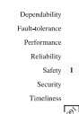
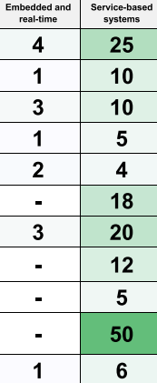

Project: SoS-Arch-TertiaryStudy
===============================

> Report created by P284574 on 31-1-2019
>
> **Report for Query: Overlapping concepts**
>
> \(54) quotations

 **2:1 At the
same time, there is vibrant development in other parts of socie......
(5:3644 \[5:4023\]) - D 2:
Axelsson\_-\_2015\_-\_A\_systematic\_mapping\_of\_the\_research\_literature\_on.pdf**

> **Created** by hcadavid on 10-8-2018
>
> At the same time, there is vibrant development in other parts of
> society, with research and development in cyber-physical systems,
> Internet of Things, and software ecosystems, that all relate to SoS.
> Getting closer ties with these communities would provide a broader
> range of example applications and building blocks, and hence lead to
> an improved understanding of SoS in general.
>
> **2 Codes:**
>
> ● Cyber physical systems / ● Internet of Things
>
> **1 Memos:**
>
> OverlappingConcepts
>
> **0 Hyperlinks**

 **3:1 For
instance, \[25\] presents a complex software- intensive SoS for
auto...... (2:1315 \[2:1862\]) - D 3:
Bianchi\_et\_al.\_-\_2015\_-\_Quality\_Attributes\_of\_Systems-of-Systems\_A\_System.pdf**

> **Created** by hcadavid on 10-8-2018, **modified** by hcadavid on
> 12-9-2018
>
> For instance, \[25\] presents a complex software- intensive SoS for
> automotive and avionics. \[5\] also presents an SoS for automotive
> embedded systems and reports that it is a new perspective to a more
> effective architecture than conventional functional
> component-and-connector model.
>
> Regarding software quality, a quality model is a model with the
> objective to describe, assess and/or predict quality, usually through
> hierarchical decomposition of the general product quality into
> sub-qualities to make them better understandable and manageable
> \[69\].
>
> **1 Codes:**
>
> ● Embedded System
>
> **1 Memos:**
>
> OverlappingConcepts
>
> **0 Hyperlinks**

 **3:4 This
class of software systems has been referred as System-of-Systems......
(1:1883 \[1:2118\]) - D 3:
Bianchi\_et\_al.\_-\_2015\_-\_Quality\_Attributes\_of\_Systems-of-Systems\_A\_System.pdf**

> **Created** by hcadavid on 14-8-2018
>
> This class of software systems has been referred as System-of-Systems
> (SoS) and can be identified in different domains, in particular,
> cyber- physical systems, such as medical systems, airport systems,
> robotic and automotive \[42\], \[50\].
>
> **1 Codes:**
>
> ● Cyber physical systems
>
> **1 Memos:**
>
> OverlappingConcepts
>
> **0 Hyperlinks**

 **3:20
Software-intensive systems have become increasingly large and
complex...... (1:1515 \[1:1880\]) - D 3:
Bianchi\_et\_al.\_-\_2015\_-\_Quality\_Attributes\_of\_Systems-of-Systems\_A\_System.pdf**

> **Created** by hcadavid on 15-1-2019
>
> Software-intensive systems have become increasingly large and complex
> and also are becoming important and even essential to the whole
> society. These systems are sometimes the outcome from the
> interoperability of constituent systems that work together in order to
> provide more complex missions that could not be completed by any of
> these systems separately \[46\], \[50\]
>
> **1 Codes:**
>
> ● Software Intensive Systems
>
> **1 Memos:**
>
> OverlappingConcepts
>
> **0 Hyperlinks**

 **4:1 The
system should be developed according to a plan that ensures the ph......
(4:4587 \[4:4775\]) - D 4:
Daneva\_and\_Lazarov\_-\_2018\_-\_Requirements\_for\_smart\_cities\_Results\_from\_a\_syst.pdf**

> **Created** by hcadavid on 10-8-2018, **modified** by hcadavid on
> 28-8-2018
>
> The system should be developed according to a plan that ensures the
> physical space and infrastructure of the city are enriched with
> embedded systems, smart devices, sensors, actuators.
>
> \[26\]
>
> **2 Codes:**
>
> ● Embedded System / ● Smart Cities
>
> **1 Memos:**
>
> OverlappingConcepts
>
> **0 Hyperlinks**

 **4:2 The
IoT services should comply the ReST paradigm (similar to web servi......
(4:1499 \[4:1679\]) - D 4:
Daneva\_and\_Lazarov\_-\_2018\_-\_Requirements\_for\_smart\_cities\_Results\_from\_a\_syst.pdf**

> **Created** by hcadavid on 10-8-2018, **modified** by hcadavid on
> 28-8-2018
>
> The IoT services should comply the ReST paradigm (similar to web
> services).
>
> The reference protocol architecture should entail both a constrained
> and an unconstrained protocol stack.
>
> **2 Codes:**
>
> ● Internet of Things / ● Smart Cities
>
> **1 Memos:**
>
> OverlappingConcepts
>
> **0 Hyperlinks**

 **4:4
However, from requirements engineering perspective, our knowledge of
s...... (1:385 \[1:615\]) - D 4:
Daneva\_and\_Lazarov\_-\_2018\_-\_Requirements\_for\_smart\_cities\_Results\_from\_a\_syst.pdf**

> **Created** by hcadavid on 15-8-2018
>
> However, from requirements engineering perspective, our knowledge of
> smart cities is fragmented; little is known about the requirements for
> smart cities as complex systems, or as systems of systems, in specific
> application domains.
>
> **2 Codes:**
>
> ● Smart Cities / ● SoS application domain: Smart Cities
>
> **0 Memos**
>
> **0 Hyperlinks**

 **4:5 These
authors defined three types of SCSs: instrumented, interconnecte......
(1:2298 \[1:2395\]) - D 4:
Daneva\_and\_Lazarov\_-\_2018\_-\_Requirements\_for\_smart\_cities\_Results\_from\_a\_syst.pdf**

> **Created** by hcadavid on 30-9-2018
>
> These authors defined three types of SCSs: instrumented,
> interconnected and intelligent systems.
>
> **4 Codes:**
>
> ○ Instrumented SCS / ○ Intelligent SCS / ○ Interconnected SCS / ●
> Smart Cities
>
> **0 Memos**
>
> **0 Hyperlinks**

 **6:1
Critical Embedded Systems (CES) are systems in which failures are
pote...... (1:863 \[1:1099\]) - D 6:
Feitosa\_et\_al.\_-\_2018\_-\_Design\_Approaches\_for\_Critical\_Embedded\_Systems\_A.pdf**

> **Created** by hcadavid on 10-8-2018
>
> Critical Embedded Systems (CES) are systems in which failures are
> potentially catastrophic and, therefore, hard constraints are imposed
> on them. In the last years the amount of software accommodated within
> CES has consid- erably changed.
>
> **2 Codes:**
>
> ● Critical Embedded Systems / ● Embedded System
>
> **1 Memos:**
>
> OverlappingConcepts
>
> **0 Hyperlinks**

 **6:2
Critical Embedded Systems (CESs) are among the most significant
types...... (2:38 \[2:439\]) - D 6:
Feitosa\_et\_al.\_-\_2018\_-\_Design\_Approaches\_for\_Critical\_Embedded\_Systems\_A.pdf**

> **Created** by hcadavid on 10-8-2018
>
> Critical Embedded Systems (CESs) are among the most significant types
> of software- intensive systems, since they are extremely pervasive in
> modern society, being used from cars to power plants \[1\]. CESs are
> embedded systems in which runtime errors can potentially be
> catastrophic \[2\], causing serious damage to the environment or to
> human lives, or non-recoverable material and financial losses \[3,
> 4\].
>
> **4 Codes:**
>
> ● Critical Embedded Systems / ● Software Intensive Systems / ● SoS
> application domain: Automotive / ● SoS application domain: Electric
> power grids
>
> **0 Memos**
>
> **0 Hyperlinks**

 **6:4
Nakagawa et al. \[18\] present the state of the art on architecting
appr...... (4:2212 \[4:2367\]) - D 6:
Feitosa\_et\_al.\_-\_2018\_-\_Design\_Approaches\_for\_Critical\_Embedded\_Systems\_A.pdf**

> **Created** by hcadavid on 23-8-2018
>
> Nakagawa et al. \[18\] present the state of the art on architecting
> approaches for systems of systems1 (SoS), of which CES are among the
> most common examples.
>
> **1 Codes:**
>
> ● Critical Embedded Systems
>
> **1 Memos:**
>
> OverlappingConcepts
>
> **1 Hyperlinks:**
>
> **◀ is inconsistent with ▶**
>  **8:1 Therefore, most of the MDD
> approaches reported in the studies regard t...... (5:661 \[5:936\]) -
> D 8:
> Graciano\_Neto\_et\_al.\_-\_2007\_-\_Investigating\_the\_Model-Driven\_Development\_for\_Sys.pdf**

 **6:7
Feitosa\_et\_al.\_-\_2018\_-\_Design\_Approaches\_for\_Critical\_Embedded\_Systems\_A.pdf
(19:42:54-19:108:150) - D 6:
Feitosa\_et\_al.\_-\_2018\_-\_Design\_Approaches\_for\_Critical\_Embedded\_Systems\_A.pdf**

> **Created** by hcadavid on 30-9-2018
>
> **Content**
>
> 
>
> **8 Codes:**
>
> ● Critical Embedded Systems / ○ Dependability / ○ Fault-tolerance / ●
> Performance Efficiency / ● Reliability / ○ Safety / ● Security / ○
> Timeliness
>
> **0 Memos**
>
> **0 Hyperlinks**

 **6:8
Specification: these activities formalize constraints (e.g., safety
re...... (14:137 \[14:458\]) - D 6:
Feitosa\_et\_al.\_-\_2018\_-\_Design\_Approaches\_for\_Critical\_Embedded\_Systems\_A.pdf**

> **Created** by hcadavid on 30-9-2018
>
> Specification: these activities formalize constraints (e.g., safety
> requirements) in the design. They define the scope/boundaries of the
> design. To draw a parallel, this type of activity is similar to the
> analysis in a software architecture design flow \[27\]. Common
> examples are formal specification languages, such as Z.
>
> **3 Codes:**
>
> ● Architectural Analysis / ● Critical Embedded Systems / ● Formal
> Specification Languages
>
> **0 Memos**
>
> **0 Hyperlinks**

 **6:9
Application Mapping: these activities generate new (partial) design
in...... (14:461 \[14:906\]) - D 6:
Feitosa\_et\_al.\_-\_2018\_-\_Design\_Approaches\_for\_Critical\_Embedded\_Systems\_A.pdf**

> **Created** by hcadavid on 30-9-2018
>
> Application Mapping: these activities generate new (partial) design
> information. A series of mappings are applied in order to refine the
> design from a more abstract representation to platform-specific
> design. In a software architecture design flow, this type of activity
> is similar to architecture synthesis \[27\]. Common approaches
> encompass: mapping of operations to concurrent tasks; mapping of
> operations to HW/SW; compilation; or scheduling.
>
> **3 Codes:**
>
> ● Architectural Synthesis / ● Critical Embedded Systems / ○ Mapping of
> Operations
>
> **0 Memos**
>
> **0 Hyperlinks**

 **6:10
Evaluation & Validation: similarly to the evaluation in a software
arc...... (14:908 \[14:1324\]) - D 6:
Feitosa\_et\_al.\_-\_2018\_-\_Design\_Approaches\_for\_Critical\_Embedded\_Systems\_A.pdf**

> **Created** by hcadavid on 30-9-2018
>
> Evaluation & Validation: similarly to the evaluation in a software
> architecture design flow \[27\], these activities evaluate design
> elements w.r.t. the objectives (e.g. provide a proper scheduling of
> tasks) and validate a design description against other descriptions.
> Examples of approaches are algorithms or analysis frameworks for
> comparing models that tackle different quality attributes, as well as
> simulations.
>
> **4 Codes:**
>
> ○ Analysis Frameworks / ● Architectural Evaluation / ● Critical
> Embedded Systems / ○ Simulation
>
> **0 Memos**
>
> **0 Hyperlinks**

 **6:11
Automotive 2 Avionics 4 Defense 1 Medical 0 Railwa...... (18:1625
\[18:1747\]) - D 6:
Feitosa\_et\_al.\_-\_2018\_-\_Design\_Approaches\_for\_Critical\_Embedded\_Systems\_A.pdf**

> **Created** by hcadavid on 30-9-2018
>
> Automotive 2 Avionics 4 Defense 1 Medical 0 Railway 2 Robotics 1 Space
> 3 Generic 5
>
> **8 Codes:**
>
> ● Critical Embedded Systems / ● SoS application domain: Automotive / ●
> Sos application domain: Avionics / ● SoS application domain: Defense
> and National Security / ○ SoS Application domain: railway / ● SoS
> application domain: Robotics / ● SoS application domain: Space system
> / ● Sos application domain: telemedicine
>
> **0 Memos**
>
> **0 Hyperlinks**

 **6:12 The
body of knowledge presented in this SMS has consid- erable overlap......
(30:2708 \[30:2972\]) - D 6:
Feitosa\_et\_al.\_-\_2018\_-\_Design\_Approaches\_for\_Critical\_Embedded\_Systems\_A.pdf**

> **Created** by hcadavid on 30-9-2018, **modified** by hcadavid on
> 30-9-2018
>
> The body of knowledge presented in this SMS has consid- erable overlap
> with other classes of system, thus we find it relevant to continue
> exploring such related classes (e.g., hard-real time systems) and seek
> approaches that can be applied to the designing of CES.
>
> **2 Codes:**
>
> ● Critical Embedded Systems / ○ Hard-real time system
>
> **1 Memos:**
>
> OverlappingConcepts
>
> **0 Hyperlinks**

 **7:17 For
instance, static discovery mechanisms and a centralized registry a......
(6:1831 \[6:2407\]) - D 7:
Gomes\_et\_al.\_-\_2015\_-\_A\_Systematic\_Mapping\_on\_Discovery\_and\_Composition\_.pdf**

> **Created** by hcadavid on 20-8-2018
>
> For instance, static discovery mechanisms and a centralized registry
> are solutions that can meet the characteristics of directed SoS, in
> which constituent systems and interactions among them are well defined
> and the SoS has control over such systems despite their operational
> and managerial independences. On the other end of the spectrum, the
> existence of a centralized or even distributed registry would not be
> adequate for virtual SoS, in which constituent systems are completely
> unaware of their participation within the SoS and their capabilities
> are discovery at runtime.
>
> **3 Codes:**
>
> ● SoS architecting gaps/problem / ● SoS constituents
> composition/discovery / ● Virtual SoS
>
> **0 Memos**
>
> **0 Hyperlinks**

 **8:1
Therefore, most of the MDD approaches reported in the studies regard
t...... (5:661 \[5:936\]) - D 8:
Graciano\_Neto\_et\_al.\_-\_2007\_-\_Investigating\_the\_Model-Driven\_Development\_for\_Sys.pdf**

> **Created** by hcadavid on 10-8-2018, **modified** by hcadavid on
> 12-9-2018
>
> Therefore, most of the MDD approaches reported in the studies regard
> to SoS composed by Critical Embedded Systems.
>
> When considering the types of model transformations, one study (8.33%)
> used exclusively model-to-model transforma- tions to generate
> software-intensive SoS \[26\].
>
> **1 Codes:**
>
> ● Critical Embedded Systems
>
> **1 Memos:**
>
> OverlappingConcepts
>
> **1 Hyperlinks:**
>
> **◀ is inconsistent with ▶**
> **6:4 Nakagawa et al. \[18\] present
> the state of the art on architecting appr...... (4:2212 \[4:2367\]) -
> D 6:
> Feitosa\_et\_al.\_-\_2018\_-\_Design\_Approaches\_for\_Critical\_Embedded\_Systems\_A.pdf**

 **8:2 H2 -
Embedded Systems community: Constituents have embedded nature and......
(6:2274 \[6:2725\]) - D 8:
Graciano\_Neto\_et\_al.\_-\_2007\_-\_Investigating\_the\_Model-Driven\_Development\_for\_Sys.pdf**

> **Created** by hcadavid on 10-8-2018, **modified** by hcadavid on
> 12-9-2018
>
> H2 - Embedded Systems community: Constituents have embedded nature and
> the problem is solved because they could have tools (as Quartus5 and
> QSYS6) that au- tomatically synthesises their constituents (that
> usually are embedded systems) and they interoperate naturally in a
> pre- configured environment;
>
> H3 - Interoperability Issue: The underlying middleware that
> interoperates constituents is a well-established product and does not
> need to be generated.
>
> **1 Codes:**
>
> ● Embedded System
>
> **1 Memos:**
>
> OverlappingConcepts
>
> **0 Hyperlinks**

 **8:17
Therefore, most of the MDD approaches reported in the studies regard
t...... (5:661 \[5:774\]) - D 8:
Graciano\_Neto\_et\_al.\_-\_2007\_-\_Investigating\_the\_Model-Driven\_Development\_for\_Sys.pdf**

> **Created** by hcadavid on 23-8-2018, **modified** by hcadavid on
> 12-9-2018
>
> Therefore, most of the MDD approaches reported in the studies regard
> to SoS composed by Critical Embedded Systems.
>
> **2 Codes:**
>
> ● Critical Embedded Systems / ○ Model-Driven-Development
>
> **1 Memos:**
>
> OverlappingConcepts
>
> **0 Hyperlinks**

 **8:18
Regarding the type of SoS, two primary studies regard Directed SoS
\[26...... (5:1353 \[5:1509\]) - D 8:
Graciano\_Neto\_et\_al.\_-\_2007\_-\_Investigating\_the\_Model-Driven\_Development\_for\_Sys.pdf**

> **Created** by hcadavid on 23-8-2018
>
> Regarding the type of SoS, two primary studies regard Directed SoS
> \[26, 33\], one describe a Collaborative SoS \[29\], and one designed
> an Acknowledged SoS \[8\].
>
> **3 Codes:**
>
> ● Acknowledged Sos / ● Collaborative SoS / ● Directed SoS
>
> **0 Memos**
>
> **0 Hyperlinks**

 **8:27 H4 -
Middleware community: Code generation for SoS is an old, well-est......
(6:2922 \[6:3345\]) - D 8:
Graciano\_Neto\_et\_al.\_-\_2007\_-\_Investigating\_the\_Model-Driven\_Development\_for\_Sys.pdf**

> **Created** by hcadavid on 23-8-2018, **modified** by hcadavid on
> 28-8-2018
>
> H4 - Middleware community: Code generation for SoS is an old,
> well-established technique and it is actually called Model-Driven
> Middleware.
>
> The last hypothesis has been refuted, at least for software- intensive
> SoS, by Ramos et. al \[31\]. They mention that the effective automatic
> generation of software-intensive SoS is a job for the future.
> Moreover, they say that agile metho- dologies should be planned in
> this direction.
>
> **4 Codes:**
>
> ○ Agile Methodologies / ○ Automatic Software/Code Generation / ●
> Research direction / ● Software-Intensive Systems of Systems
>
> **1 Memos:**
>
> OverlappingConcepts
>
> **0 Hyperlinks**

 **8:32
software-intensive Systems-of-Systems (SoS) is a class of software
sys...... (1:748 \[1:915\]) - D 8:
Graciano\_Neto\_et\_al.\_-\_2007\_-\_Investigating\_the\_Model-Driven\_Development\_for\_Sys.pdf**

> **Created** by hcadavid on 15-1-2019
>
> software-intensive Systems-of-Systems (SoS) is a class of software
> systems that have emerged over the iminence of large systems which
> have a high-level of complexity.
>
> **1 Codes:**
>
> ● Software-Intensive Systems of Systems
>
> **1 Memos:**
>
> OverlappingConcepts
>
> **0 Hyperlinks**

 **9:1 In
this sense, while some of the charac- teristics stated in the
previ...... (2:1868 \[2:2587\]) - D 9:
Guessi\_et\_al.\_-\_2015\_-\_A\_systematic\_literature\_review\_on\_the\_description\_.pdf**

> **Created** by hcadavid on 10-8-2018, **modified** by hcadavid on
> 12-9-2018
>
> In this sense, while some of the charac- teristics stated in the
> previous section may be shared with other domains, such as embedded
> systems, it is the conjunc- tion of all these five characteristics
> that sets SoS apart from conventional software systems. For example,
> an aircraft soft- ware system is a complex, embedded software system
> which encompasses entertainment, navigation, localization, engine, and
> control systems. However, an aircraft software system is not regarded
> as an SoS because its sub-systems do not self-operate or self-manage
> \[7\]. But, once a software system becomes able to self-operate and
> self-manage, it will have more chances of joining in complex system
> structures that can be viewed as SoS.
>
> **2 Codes:**
>
> ○ Complex System / ● Embedded System
>
> **1 Memos:**
>
> OverlappingConcepts
>
> **0 Hyperlinks**

 **10:7
Collaborative and virtual systems of systems are related to industry
p...... (7:1228 \[7:1915\]) - D 10:
Klein\_and\_van\_Vliet\_-\_2013\_-\_A\_systematic\_review\_of\_system-of-systems\_architect.pdf**

> **Created** by hcadavid on 21-8-2018, **modified** by hcadavid on
> 28-8-2018
>
> Collaborative and virtual systems of systems are related to industry
> platforms and software ecosystems. An industry platform provides the
> core technology that allows systems constructed by different
> organizations to interact to produce some value \[6\]. In both
> collaborative and virtual systems of systems, an industry platform can
> broker interactions between participating systems and provide
> incentives to join the system of systems and to behave in particular
> ways in the system of systems. The relationships among the systems
> using an industry platform and among the organizations constructing
> those systems create an ecosystem with cooperation and competition
> among participants \[17\].
>
> **4 Codes:**
>
> ● Collaborative SoS / ○ Industry Platforms / ● Software Ecosystems / ●
> Virtual SoS
>
> **1 Memos:**
>
> OverlappingConcepts
>
> **0 Hyperlinks**

 **11:1
Rule-Driven Methodology for Developing IT Ecosystems Product Line on
C...... (5:297 \[5:437\]) - D 11:
Lana\_et\_al.\_-\_2016\_-\_Systems-of-systems\_development\_Initiatives,\_trend.pdf**

> **Created** by hcadavid on 10-8-2018
>
> Rule-Driven Methodology for Developing IT Ecosystems Product Line on
> Critical Embedded Systems (ProLiCES) Approach
>
> SoS Development Frameworks
>
> **2 Codes:**
>
> ● Critical Embedded Systems / ○ ProLiCES
>
> **0 Memos**
>
> **0 Hyperlinks**

 **11:2 For
instance, the study S6, which discusses the problems of proprietar......
(8:3283 \[8:3630\]) - D 11:
Lana\_et\_al.\_-\_2016\_-\_Systems-of-systems\_development\_Initiatives,\_trend.pdf**

> **Created** by hcadavid on 10-8-2018
>
> For instance, the study S6, which discusses the problems of
> proprietary solutions to the Distributed Real-time and Embedded
> Systems, considered the characteristics emergent behavior,
> heterogeneous, and interoperability. It is important to say that the
> authors did not provide information on the reason to choose these
> characteristics in their work.
>
> **3 Codes:**
>
> ● Embedded System / ○ Emergent Behaviour / ○ Interoperability
>
> **0 Memos**
>
> **0 Hyperlinks**

 **11:3 Model
of Components for Adaptive Systems (MOCAS) S11 Time-sequenced Wa......
(5:1259 \[5:1616\]) - D 11:
Lana\_et\_al.\_-\_2016\_-\_Systems-of-systems\_development\_Initiatives,\_trend.pdf**

> **Created** by hcadavid on 10-8-2018, **modified** by hcadavid on
> 28-8-2018
>
> Model of Components for Adaptive Systems (MOCAS) S11 Time-sequenced
> Wave Model to SoS SE S19 SOSE Integration Model S20 Agent-Based Model
> S28 Incentive-Based Negotiation Model S33 Others Initiatives to SoS
> Development ID Collaborative Product Line Software and Systems
> Engineering S7 (CoPulSE)
>
> Model-Based Design Methodologies and Supporting Design S13 Tools
>
> **1 Codes:**
>
> ● Adaptive systems
>
> **1 Memos:**
>
> OverlappingConcepts
>
> **0 Hyperlinks**

 **11:34
Systems-of-Systems (SoS1) correspond to an class of complex and
large...... (1:1624 \[1:1895\]) - D 11:
Lana\_et\_al.\_-\_2016\_-\_Systems-of-systems\_development\_Initiatives,\_trend.pdf**

> **Created** by hcadavid on 15-1-2019
>
> Systems-of-Systems (SoS1) correspond to an class of complex and large
> software-intensive systems (e.g., for military, security, and
> aerospace), which result from the interoperability of several
> managerial and operationally independent software systems called
> constituents.
>
> **1 Codes:**
>
> ● Software Intensive Systems
>
> **1 Memos:**
>
> OverlappingConcepts
>
> **0 Hyperlinks**

 **12:2
Cyber-physical systems and SoS. Cyber-physical systems (CPS) can be
de...... (6:6070 \[7:65\]) - D 12:
Maia\_et\_al.\_-\_2007\_-\_On\_the\_Development\_of\_Systems-of-Systems\_based\_on\_.pdf**

> **Created** by hcadavid on 10-8-2018, **modified** by hcadavid on
> 12-9-2018
>
> Cyber-physical systems and SoS. Cyber-physical systems (CPS) can be
> defined as large, complex networked informa- tion systems that
> interact with physical processes and en- vironments through
> geographically distributed devices. As networked information systems,
> CPS encompass computa- tion, human activities, and automated
> decision-making en- abled by information and communication technology.
> More- over, they are aimed at monitoring, controlling, and inte-
> grating physical processes and environments to support op- erations
> and management in the physical worlds \[8\]. CPS can scale from
> micro-level, embedded systems to large, com- plex SoS composed of
> heterogeneous IoT-based constituent systems or even other CPS, besides
> exhibiting typical fea- tures of SoS such as distributed control,
> independence of the constituent systems, emergent behaviors,
> evolutionary development, etc. In this context, a promising initiative
> is the CPSoS Project \[5\], an European consortium started on October
> 2013 that aims to identify industrial and societal needs and the state
> of the art of tools and theories for the
>
> research and development of cyber-physical SoS in the next years.
>
> **3 Codes:**
>
> ● Cyber physical systems / ● Embedded System / ● Internet of Things
>
> **1 Memos:**
>
> OverlappingConcepts
>
> **0 Hyperlinks**

 **12:5 From
the analyzed studies, we have identified some func- tional requir......
(4:3071 \[5:855\]) - D 12:
Maia\_et\_al.\_-\_2007\_-\_On\_the\_Development\_of\_Systems-of-Systems\_based\_on\_.pdf**

> **Created** by hcadavid on 10-8-2018, **modified** by hcadavid on
> 27-8-2018
>
> From the analyzed studies, we have identified some func- tional
> requirements and non-functional features on the in- tegration of the
> IoT paradigm and SoS engineering. The main functional requirements are
> presented in study S5: (i) communication abstraction as means of
> addressing interop- erability and heterogeneity concerns; (ii) unified
> informa- tion models, which are used as means of sharing information
>
> Automated Search
>
> IEEEXplore ACM Digital Library ScienceDirect.com Scopus
>
> ISI Web of Science SpringerLink
>
> Researcher 1:
>
> selection by title, abstract, and keywords
>
> Researcher 2:
>
> selection by title, abstract, and keywords
>
> Researcher 3:
>
> selection by title, abstract, and keywords
>
> Agreement Meeting
>
> Researcher 1:
>
> selection by full reading
>
> Researcher 2:
>
> selection by full reading
>
> Researcher 3:
>
> selection by full reading
>
> Agreement Meeting
>
> Final set of relevant studies selected for analysis and data
> extraction
>
> Filtering
>
> removal of studies indexed by more than one source
>
> 93
>
> search results
>
> Selection
>
> application of selection criteria on title, abstract, and keywords
>
> 83
>
> potentially relevant
>
> Selection
>
> application of inclusion/exclusion criteria on full paper
>
> 15
>
> potentially relevant
>
> Snowballing
>
> inclusion of referenced studies not retrieved by the search procedure
>
> 4
>
> potentially relevant
>
> Selection
>
> application of inclusion/exclusion criteria on full paper
>
> 5
>
> potentially relevant
>
> 5
>
> relevant (final set)
>
> Final Selection Preliminary Selection
>
> Number of studies
>
> Index rate
>
> Retrieved Filtered Selected
>
> 751 221 110
>
> 13 8 1 220 68 7 2
>
> 20.00% 20.00% 0.00% 20.00% 0.00% 40.00%
>
> Source
>
> Table 2: Number of retrieved, filtered, and selected studies per
> source. Precision rate
>
> IEEEXplore
>
> ACM Digital Library ScienceDirect.com Scopus
>
> ISI Web of Science SpringerLink
>
> 14.29% 50.00% 0.00% 7.69% 0.00% 2.94%
>
> Reference
>
> \[23\] \[1\] \[13\] \[8\] \[6\]
>
> ID
>
> S1 S2 S3 S4 S5
>
> Title
>
> Table 3: Selected primary studies.
>
> Publication year
>
> Combining cloud and sensors in a smart city environment SCCIR: Smart
> cities critical infrastructure response framework Smart cities at the
> forefront of the Future Internet Web-of-Things framework for
> cyber-physical systems
>
> Towards an IoT ecosystem
>
> 2012
>
> 2011
>
> 2011
>
> 2011
>
> 2013
>
> among different
>
> open services development, which is aimed to ensure interop- erability
> at both application and service levels.
>
> **4 Codes:**
>
> ○ communication abstraction / ● Internet of Things / ○ open services
> development / ○ unified information models
>
> **0 Memos**
>
> **0 Hyperlinks**

 **12:6 Due
to the promising integration of IoT-based systems in order to comp......
(2:596 \[2:1028\]) - D 12:
Maia\_et\_al.\_-\_2007\_-\_On\_the\_Development\_of\_Systems-of-Systems\_based\_on\_.pdf**

> **Created** by hcadavid on 10-8-2018
>
> Due to the promising integration of IoT-based systems in order to
> compose complex SoS, a study addressing a com- prehensive analysis
> about this topic seems to be quite rel- evant. In this perspective,
> the main goal of this paper is to present an overview about the
> current scenarios and ap- proaches in the development of IoT-based
> SoS, as well as to identify and discuss some challenges and research
> opportu- nities in this context.
>
> **2 Codes:**
>
> ● Internet of Things / ● IoT-based SoS
>
> **0 Memos**
>
> **0 Hyperlinks**

 **12:7 The
integration of these independent and heterogeneous systems leads t......
(1:4578 \[1:4886\]) - D 12:
Maia\_et\_al.\_-\_2007\_-\_On\_the\_Development\_of\_Systems-of-Systems\_based\_on\_.pdf**

> **Created** by hcadavid on 27-8-2018, **modified** by hcadavid on
> 27-8-2018
>
> The integration of these independent and heterogeneous systems leads
> to the so-called systems-of-systems (SoS) \[15\]. A SoS can be
> understood as a widespread set of complex, independent, heterogeneous
> constituent systems that have their own purpose and cooperate in order
> to achieve a com- mon global mission.
>
> **1 Codes:**
>
> ● Internet of Things
>
> **1 Memos:**
>
> OverlappingConcepts
>
> **0 Hyperlinks**

 **12:8 This
research question is related to what has been researched on the d......
(4:2007 \[4:2242\]) - D 12:
Maia\_et\_al.\_-\_2007\_-\_On\_the\_Development\_of\_Systems-of-Systems\_based\_on\_.pdf**

> **Created** by hcadavid on 27-8-2018, **modified** by hcadavid on
> 12-9-2018
>
> This research question is related to what has been researched on the
> development of IoT-based SoS, i.e., IoT- based complex, heterogeneous
> systems that collaborate in order to achieve a given functionality (or
> set of functional- ities).
>
> **2 Codes:**
>
> ● Internet of Things / ● IoT-based SoS
>
> **1 Memos:**
>
> OverlappingConcepts
>
> **0 Hyperlinks**

 **12:9 For
this reason, most efforts are concentrated on: (i) understanding t......
(4:2581 \[4:3069\]) - D 12:
Maia\_et\_al.\_-\_2007\_-\_On\_the\_Development\_of\_Systems-of-Systems\_based\_on\_.pdf**

> **Created** by hcadavid on 27-8-2018
>
> For this reason, most efforts are concentrated on: (i) understanding
> the re- quirements for these systems and the application domains in
> which they can be deployed; (ii) designing and imple- menting high
> level architectures and frameworks that could support and provide
> applications in SoS based on sensor and actuator networks (SANs) and
> on the IoT itself, and; (iii) developing realistic large-scale
> testbeds that enable proof- of-concept implementations and leverage
> further researches.
>
> **4 Codes:**
>
> ● High Level Architectures for IoT/SAN -based SoS / ● Internet of
> Things / ● IoT-based SoS / ● Large-scale testbeds environments
>
> **0 Memos**
>
> **0 Hyperlinks**

 **12:11 In
turn, the most relevant non-functional features to be tackled in
Io...... (5:857 \[5:1608\]) - D 12:
Maia\_et\_al.\_-\_2007\_-\_On\_the\_Development\_of\_Systems-of-Systems\_based\_on\_.pdf**

> **Created** by hcadavid on 27-8-2018
>
> In turn, the most relevant non-functional features to be tackled in
> IoT- based systems are highlighted in study S3: (i) scale, which is
> related to the need of coordinating a myriad of devices to perform
> tasks; (ii) heterogeneity of devices and systems, which requires
> interoperability issues to address this con- cern; (iii) resource
> constraints in terms of time, memory, energy consumption, processing
> power, etc.; (iv) uncertain- ties, which are related to the dynamic
> discovery of devices and systems, as well as adaptation and
> context-awareness capabilities; (v) conflict resolution, which is
> aimed to solve possible conflicts in terms of the devices and systems,
> and; (vi) management issues related to massive data, privacy, and
> security concerns.
>
> **8 Codes:**
>
> ○ Adaptability / ● Conflict resolution / ● Internet of Things / ○
> Interoperability / ○ Resource Constraints / ○ Scalability / ● SoS
> constituents composition/discovery / ○ Uncertainities Handling(\*)
>
> **0 Memos**
>
> **0 Hyperlinks**

 **12:12 This
research question stands for the application domains in which IoT......
(5:1615 \[5:2765\]) - D 12:
Maia\_et\_al.\_-\_2007\_-\_On\_the\_Development\_of\_Systems-of-Systems\_based\_on\_.pdf**

> **Created** by hcadavid on 27-8-2018, **modified** by hcadavid on
> 28-8-2018
>
> This research question stands for the application domains in which
> IoT-based SoS have been deployed. We have noticed that three of the
> five selected studies (S1, S2, and S3 ) target smart cities as the
> main reference scenario for their proposals. As presented in these
> studies, smart cities rely on information and communication
> technologies for col- lecting data from several urban sensors, such as
> electric me- ters, GPS devices, building sensors, and weather sensors,
> which can range from simple sensors to complex SANs. In order to be
> used in management, education, health care, transportation, and public
> safety services of a smart city, these sensor systems can be
> associated to a building, a fac- tory, city roads, or even to a whole
> city. With the informa- tion provided by IoT, such systems would be
> able to elabo- rate complex decision-making processes and communicate
> to each other by combining the information that they provide. In this
> perspective, smart cities can clearly be viewed as an example of SoS
> leveraged by the IoT paradigm, which would provide the levels of
> information that smart cities require for their constituent systems.
>
> **4 Codes:**
>
> ● Internet of Things / ● IoT-based SoS / ● Smart Cities / ● SoS
> application domain: Smart Cities
>
> **1 Memos:**
>
> OverlappingConcepts
>
> **0 Hyperlinks**

 **12:13
Another interesting application domain refers to intelli- gent
vehicle...... (5:2767 \[5:2871\]) - D 12:
Maia\_et\_al.\_-\_2007\_-\_On\_the\_Development\_of\_Systems-of-Systems\_based\_on\_.pdf**

> **Created** by hcadavid on 27-8-2018
>
> Another interesting application domain refers to intelli- gent vehicle
> systems, as presented by study S4.
>
> **3 Codes:**
>
> ● Internet of Things / ● IoT-based SoS / ● SoS application domain:
> Automotive
>
> **0 Memos**
>
> **0 Hyperlinks**

 **12:15
Another interesting application domain refers to intelli- gent
vehicle...... (5:2767 \[5:2949\]) - D 12:
Maia\_et\_al.\_-\_2007\_-\_On\_the\_Development\_of\_Systems-of-Systems\_based\_on\_.pdf**

> **Created** by hcadavid on 28-8-2018
>
> Another interesting application domain refers to intelli- gent vehicle
> systems, as presented by study S4. In this do- main, roadside units
> include road sensors, tolls, traffic lights,
>
> **3 Codes:**
>
> ● Internet of Things / ● IoT-based SoS / ● SoS application domain:
> Automotive
>
> **0 Memos**
>
> **0 Hyperlinks**

 **12:16 (i)
a layer associated to devices in which het- erogeneous devices are......
(5:4977 \[5:5101\]) - D 12:
Maia\_et\_al.\_-\_2007\_-\_On\_the\_Development\_of\_Systems-of-Systems\_based\_on\_.pdf**

> **Created** by hcadavid on 28-8-2018
>
> \(i) a layer associated to devices in which het- erogeneous devices are
> responsible for data provisioning and actuating tasks;
>
> **3 Codes:**
>
> ○ Devices Abstraction Layer / ● Internet of Things / ● IoT-based SoS
>
> **0 Memos**
>
> **0 Hyperlinks**

 **12:17 an
aggregation layer, which is respon- sible for abstracting the
commu...... (5:5108 \[5:5254\]) - D 12:
Maia\_et\_al.\_-\_2007\_-\_On\_the\_Development\_of\_Systems-of-Systems\_based\_on\_.pdf**

> **Created** by hcadavid on 28-8-2018
>
> an aggregation layer, which is respon- sible for abstracting the
> communication with sensors and actuators and for aggregating data
> provided by them
>
> **3 Codes:**
>
> ○ Aggregation Layer / ● Internet of Things / ● IoT-based SoS
>
> **0 Memos**
>
> **0 Hyperlinks**

 **12:18
application/services layer, which is responsible for providing
service...... (6:33 \[6:239\]) - D 12:
Maia\_et\_al.\_-\_2007\_-\_On\_the\_Development\_of\_Systems-of-Systems\_based\_on\_.pdf**

> **Created** by hcadavid on 28-8-2018
>
> application/services layer, which is responsible for providing
> services and applications to end-users, decision-making systems, and
> control systems based on the information provided by the aggregation
> layer.
>
> **3 Codes:**
>
> ● Internet of Things / ● IoT-based SoS / ○ Services Layer
>
> **0 Memos**
>
> **0 Hyperlinks**

 **12:19 The
layer associated to devices is typically composed of two sub-layer......
(6:558 \[6:709\]) - D 12:
Maia\_et\_al.\_-\_2007\_-\_On\_the\_Development\_of\_Systems-of-Systems\_based\_on\_.pdf**

> **Created** by hcadavid on 28-8-2018
>
> The layer associated to devices is typically composed of two
> sub-layers, namely communication protocol abstraction and devices data
> format abstraction.
>
> **5 Codes:**
>
> ○ communication abstraction / ○ device data format abstraction / ○
> Devices Abstraction Layer / ● Internet of Things / ● IoT-based SoS
>
> **0 Memos**
>
> **0 Hyperlinks**

 **12:21 In
regards to de- vice heterogeneity, recent work in the literature
ha...... (6:2962 \[6:3338\]) - D 12:
Maia\_et\_al.\_-\_2007\_-\_On\_the\_Development\_of\_Systems-of-Systems\_based\_on\_.pdf**

> **Created** by hcadavid on 28-8-2018
>
> In regards to de- vice heterogeneity, recent work in the literature
> has pointed out that middleware platforms would provide interoperabil-
> ity capabilities and abstractions over physical devices and services
> to applications and/or end-users, as well as means of managing the
> increasingly myriad of IoT devices associ- ated to the systems that
> use data provided by them \[3, 26\].
>
> **3 Codes:**
>
> ● Internet of Things / ● IoT-based SoS / ● Research direction
>
> **0 Memos**
>
> **0 Hyperlinks**

 **12:22
Therefore, it is also necessary to provide means to integrate the
dist...... (6:3659 \[6:3967\]) - D 12:
Maia\_et\_al.\_-\_2007\_-\_On\_the\_Development\_of\_Systems-of-Systems\_based\_on\_.pdf**

> **Created** by hcadavid on 28-8-2018
>
> Therefore, it is also necessary to provide means to integrate the
> distributed constituent sys- tems of a SoS by abstracting away the
> specificities of each heterogeneous system and dealing with
> interoperability is- sues in order to enable their cooperation to
> fulfill the global purposes of the SoS as a whole.
>
> **3 Codes:**
>
> ● Internet of Things / ● IoT-based SoS / ● Research direction
>
> **0 Memos**
>
> **0 Hyperlinks**

 **14:1 We
have highlighted the need for new or innovative business models,
su...... (1:2455 \[1:2696\]) - D 14:
Papatheocharous\_et\_al.\_-\_2015\_-\_Ecosystems\_and\_Open\_Innovation\_for\_Embedded\_System.pdf**

> **Created** by hcadavid on 10-8-2018
>
> We have highlighted the need for new or innovative business models,
> sustainable networks, ecologies or federations in the embedded systems
> domain, as they are less flexible and resilient to
>
> © Springer International Publishing Switzerland 2015
>
> **1 Codes:**
>
> ● Embedded System
>
> **0 Memos**
>
> **0 Hyperlinks**

 **17:1 This
area cov- ers approaches supporting monitoring properties in embe......
(5:5753 \[5:5953\]) - D 17:
Vierhauser\_et\_al.\_-\_2016\_-\_Requirements\_monitoring\_frameworks\_A\_systematic\_r.pdf**

> **Created** by hcadavid on 10-8-2018
>
> This area cov- ers approaches supporting monitoring properties in
> embedded systems \[A90\] or monitoring timing constraints in real-time
> ap- plications \[A316\].
>
> • Service-based systems (165 publications).
>
> **3 Codes:**
>
> ● Embedded System / ○ Hard-real time system / ● SoS Requirements
> Monitoring
>
> **0 Memos**
>
> **0 Hyperlinks**

 **17:2 •
(Self-)Adaptive systems (5 publications). This area covers ap-
proac...... (5:6748 \[5:7021\]) - D 17:
Vierhauser\_et\_al.\_-\_2016\_-\_Requirements\_monitoring\_frameworks\_A\_systematic\_r.pdf**

> **Created** by hcadavid on 10-8-2018, **modified** by hcadavid on
> 29-8-2018
>
> • (Self-)Adaptive systems (5 publications). This area covers ap-
> proaches focusing on the adaptation of the system based on monitored
> events and data, e.g., replacing a component with low performance with
> a better alternative providing the same functionality (e.g.,
> \[A289\]).
>
> **2 Codes:**
>
> ● Adaptive systems / ● SoS Requirements Monitoring
>
> **1 Memos:**
>
> OverlappingConcepts
>
> **0 Hyperlinks**

 **17:5
Vierhauser\_et\_al.\_-\_2016\_-\_Requirements\_monitoring\_frameworks\_A\_systematic\_r.pdf
(7:174:59-7:304:375) - D 17:
Vierhauser\_et\_al.\_-\_2016\_-\_Requirements\_monitoring\_frameworks\_A\_systematic\_r.pdf**

> **Created** by hcadavid on 30-9-2018, **modified** by hcadavid on
> 1-10-2018
>
> **Content**
>
> 
>
> **9 Codes:**
>
> ○ AI / Knowledge Based approach / ● Automata Monitoring / ● Embedded
> System / ○ Hard-real time system / ● Model-checking / ○ SOA - Service
> Oriented Architecture / ● SoS Requirements Monitoring / ● Temporal
> Logic Monitoring / ○ UML
>
> **1 Memos:**
>
> OverlappingConcepts
>
> **0 Hyperlinks**

 **18:1
Industry 4.0 is the application of systems engineering concepts,
metho...... (8:2863 \[8:3048\]) - D 18:
Wortmann\_et\_al.\_-\_2017\_-\_A\_Systematic\_Mapping\_Study\_on\_Modeling\_for\_Industr.pdf**

> **Created** by hcadavid on 10-8-2018
>
> Industry 4.0 is the application of systems engineering concepts,
> methods, and tools to the development of adaptive systems of systems
> that enable smart manufacturing with CPS in the IoT.
>
> **1 Codes:**
>
> ● Internet of Things
>
> **0 Memos**
>
> **0 Hyperlinks**

 **18:2
Industry 4.0 is the application of systems engineering concepts,
metho...... (8:2863 \[8:3211\]) - D 18:
Wortmann\_et\_al.\_-\_2017\_-\_A\_Systematic\_Mapping\_Study\_on\_Modeling\_for\_Industr.pdf**

> **Created** by hcadavid on 10-8-2018
>
> Industry 4.0 is the application of systems engineering concepts,
> methods, and tools to the development of adaptive systems of systems
> that enable smart manufacturing with CPS in the IoT. Model-based
> systems engineering has shown to facilitate development of such
> systems, but its application to Industry 4.0 was not systematically
> investigated, yet.
>
> **5 Codes:**
>
> ● Adaptive systems / ● Industry 4.0 / ● Internet of Things / ●
> IoT-based SoS / ○ Model-Based System Engineering (MBSE)
>
> **1 Memos:**
>
> OverlappingConcepts
>
> **0 Hyperlinks**

 **19:1 There
are various systems that can be classified as SoS. An example is......
(2:3066 \[2:3383\]) - D 19:
Nakagawa\_et\_al\_The\_State\_of\_the\_Art\_and\_Future\_Perspectives\_in\_Systems\_of\_Systems\_Software\_Architectures.pdf**

> **Created** by hcadavid on 29-8-2018, **modified** by hcadavid on
> 12-9-2018
>
> There are various systems that can be classified as SoS. An example is
> a medical system that integrates systems to diag- nosis, treatment,
> and management of patients \[24\]. Exam- ples involving critical
> embedded systems can be also found, such as airport systems \[28\],
> automotive \[5\], avionics \[19\], and robotics \[10\].
>
> **4 Codes:**
>
> ● Critical Embedded Systems / ● SoS application domain: Air traffic
> control / ● SoS application domain: Automotive / ● SoS application
> domain: Robotics
>
> **1 Memos:**
>
> OverlappingConcepts
>
> **0 Hyperlinks**

 **19:2
However, in spite of their relevance, the development of SoS for
softw...... (2:3553 \[2:3718\]) - D 19:
Nakagawa\_et\_al\_The\_State\_of\_the\_Art\_and\_Future\_Perspectives\_in\_Systems\_of\_Systems\_Software\_Architectures.pdf**

> **Created** by hcadavid on 29-8-2018, **modified** by hcadavid on
> 29-8-2018
>
> However, in spite of their relevance, the development of SoS for
> software-intensive systems has not been widely investigated in the
> context of Software Engineering.
>
> **1 Codes:**
>
> ● Software-Intensive Systems of Systems
>
> **1 Memos:**
>
> OverlappingConcepts
>
> **0 Hyperlinks**
