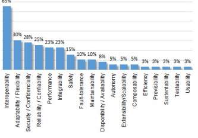

Project: SoS-Arch-TertiaryStudy
===============================

> \(148) quotations

**1:1 In
this sense, Knowledge Representation approaches can provide the
mea...... (6:3520 \[6:3710\]) - D 1:
Abdalla\_et\_al.\_-\_2015\_-\_A\_Systematic\_Literature\_Review\_on\_Knowledge\_Repres.pdf**

> **Created** by hcadavid on 10-8-2018
>
> In this sense, Knowledge Representation approaches can provide the
> means for supporting interoperability between systems. Here we had the
> studies S1, S5, S6, S14, S16, S28, S20, S21, and S30.
>
> **2 Codes:**
>
> ● Compatibility / ○ Interoperability
>
> **0 Memos**
>
> **0 Hyperlinks**

**1:8
Knowledge Representation approaches to the field of SoS (1:3524
\[1:3578\]) - D 1:
Abdalla\_et\_al.\_-\_2015\_-\_A\_Systematic\_Literature\_Review\_on\_Knowledge\_Repres.pdf**

> **Created** by hcadavid on 14-8-2018
>
> Knowledge Representation approaches to the field of SoS
>
> **1 Codes:**
>
> ● SoS Knowledge representation
>
> **0 Memos**
>
> **0 Hyperlinks**

**2:2 The
ones that were mentioned more than just a few times were: Sustaina......
(5:664 \[5:1058\]) - D 2:
Axelsson\_-\_2015\_-\_A\_systematic\_mapping\_of\_the\_research\_literature\_on.pdf**

> **Created** by hcadavid on 10-8-2018
>
> The ones that were mentioned more than just a few times were:
> Sustainability (8%); Interoperability (7%); Cost, Effectiveness,
> Safety, and Security (each 6%); and Efficiency and Reliability (each
> 5%). Although the sample does not allow us to determine the exact
> ranking of these properties in the total set of papers, they are all
> likely to be important characteristics of the SoS research area.
>
> **8 Codes:**
>
> ● Effectiveness / ● Efficiency / ○ Interoperability / ● Reliability /
> ○ Safety / ● Security / ○ Software Quality Attributes / ○
> Sustainability
>
> **0 Memos**
>
> **0 Hyperlinks**

**2:3 clear:
21% of the papers were from the Military domain, followed by 11......
(4:2689 \[4:2780\]) - D 2:
Axelsson\_-\_2015\_-\_A\_systematic\_mapping\_of\_the\_research\_literature\_on.pdf**

> **Created** by hcadavid on 7-9-2018
>
> clear: 21% of the papers were from the Military domain, followed by
> 11% from the Space area.
>
> **2 Codes:**
>
> ● SoS application domain: Militar / ● SoS application domain: Space
> system
>
> **0 Memos**
>
> **0 Hyperlinks**

**2:4
However, there were also 18 other application areas mentioned, each
wi...... (4:2782 \[4:3142\]) - D 2:
Axelsson\_-\_2015\_-\_A\_systematic\_mapping\_of\_the\_research\_literature\_on.pdf**

> **Created** by hcadavid on 7-9-2018, **modified** by hcadavid on
> 7-9-2018
>
> However, there were also 18 other application areas mentioned, each
> with between 1-5%, including Health care, Disaster management,
> Aircrafts, Robotics, Power systems, etc. 67% of the papers related to
> at least one application area.
>
> An area worth special comments is earth observation. Many papers
> addressed the Global Earth Observation System of Systems (GEOSS)
>
> **6 Codes:**
>
> ● Sos application domain: Avionics / ● SoS application domain:
> Disaster Management / ● SoS application domain: Earth Observation
> Systems / ● SoS application domain: Electric power grids / ● SoS
> application domain: Healthcare / ● SoS application domain: Robotics
>
> **0 Memos**
>
> **0 Hyperlinks**

**2:6 The
ones that stood out were Modeling (22%) and Integration (17%). At......
(5:319 \[5:488\]) - D 2:
Axelsson\_-\_2015\_-\_A\_systematic\_mapping\_of\_the\_research\_literature\_on.pdf**

> **Created** by hcadavid on 7-9-2018, **modified** by hcadavid on
> 25-9-2018
>
> The ones that stood out were Modeling (22%) and Integration (17%). At
> a somewhat lower level, Risk management (9%), and Requirements and
> Design (each 7%) were significan
>
> Comment: by hcadavid
>
> System of Systems Integration: Key Considerations and Challenges Azad
> M. Madni.
>
> SoSI is intended to create a new mission capability through
> composition of component systems that contribute to the overall
> capability.
>
> \--\> Integration means composition in SoS context.
>
> **6 Codes:**
>
> ● SoS constituents composition/discovery / ● SoS Design / ● SoS
> modelling / ● SoS Requirements / ● SoS Risk Management / ● Systems of
> Systems Integration - SoSI
>
> **0 Memos**
>
> **0 Hyperlinks**

**3:6
However, new application scenarios of SoS have been considered as it
i...... (5:46 \[5:212\]) - D 3:
Bianchi\_et\_al.\_-\_2015\_-\_Quality\_Attributes\_of\_Systems-of-Systems\_A\_System.pdf**

> **Created** by hcadavid on 15-8-2018
>
> However, new application scenarios of SoS have been considered as it
> is presented on Figure 5 that highlights the domains "IT Systems",
> "Smart Grids" and "Automotive".
>
> **1 Codes:**
>
> ● SoS application domain: others
>
> **0 Memos**
>
> **0 Hyperlinks**

**3:7 On the
IT Systems domain, studies S10, S27, S44 state that this system......
(5:214 \[5:518\]) - D 3:
Bianchi\_et\_al.\_-\_2015\_-\_Quality\_Attributes\_of\_Systems-of-Systems\_A\_System.pdf**

> **Created** by hcadavid on 15-8-2018
>
> On the IT Systems domain, studies S10, S27, S44 state that this
> systems have increasingly incorporated SoS characteristics due to
> their integration requirements with third party systems. More
> specically, study S27 indicates that this is a tendency due to
> popularization of cloud computing on the industry.
>
> **2 Codes:**
>
> ● Compatibility / ● SoS application domain: IT Systems
>
> **0 Memos**
>
> **0 Hyperlinks**

**3:8
According to studies S42, S47 and S50, Smart Grids domain is been
inve...... (5:520 \[5:796\]) - D 3:
Bianchi\_et\_al.\_-\_2015\_-\_Quality\_Attributes\_of\_Systems-of-Systems\_A\_System.pdf**

> **Created** by hcadavid on 15-8-2018
>
> According to studies S42, S47 and S50, Smart Grids domain is been
> investigated in the context of energy management systems that have as
> main priority the integration with communication services in order to
> detect and address incidents before they compromise the power
> offering.
>
> **2 Codes:**
>
> ● Reliability / ● SoS application domain: Smart Grids
>
> **0 Memos**
>
> **0 Hyperlinks**

**3:9
Finally, the Automotive domain is addressed by studies S4, S14 and
S17...... (5:798 \[5:1266\]) - D 3:
Bianchi\_et\_al.\_-\_2015\_-\_Quality\_Attributes\_of\_Systems-of-Systems\_A\_System.pdf**

> **Created** by hcadavid on 15-8-2018
>
> Finally, the Automotive domain is addressed by studies S4, S14 and S17
> which state that a modern automotive industry is typically driven by
> the integration of more than 50 embedded computers, also known as ECUs
> (Electronic Control Units). More specifically, study S17 investigates
> vehicles and roadside units that can communicate in ad hoc way to
> exchange information, such as safety warnings and traffic information,
> in order to avoid accidents and traffic congestion.
>
> **2 Codes:**
>
> ● Compatibility / ● SoS application domain: Automotive
>
> **0 Memos**
>
> **0 Hyperlinks**

**3:10 Some
of these scenarios are related with safety-critical systems in wh......
(6:1334 \[6:1513\]) - D 3:
Bianchi\_et\_al.\_-\_2015\_-\_Quality\_Attributes\_of\_Systems-of-Systems\_A\_System.pdf**

> **Created** by hcadavid on 15-8-2018
>
> Some of these scenarios are related with safety-critical systems in
> which failure may cause death or injury to people, harm to the
> environment, or substantial finantial losses \[13\]
>
> **1 Codes:**
>
> ● SoS application domain: Safety-critical system
>
> **0 Memos**
>
> **0 Hyperlinks**

**3:11 In
these situations, the SoS must be able to react appropriately to
dy...... (6:1516 \[6:1648\]) - D 3:
Bianchi\_et\_al.\_-\_2015\_-\_Quality\_Attributes\_of\_Systems-of-Systems\_A\_System.pdf**

> **Created** by hcadavid on 15-8-2018
>
> In these situations, the SoS must be able to react appropriately to
> dynamic changes in order to assure its behavior and quality \[58\].
>
> **1 Codes:**
>
> ● Reliability
>
> **0 Memos**
>
> **0 Hyperlinks**

**3:13
Regarding the quality attributes definitions, this work has found
that...... (6:1993 \[6:2399\]) - D 3:
Bianchi\_et\_al.\_-\_2015\_-\_Quality\_Attributes\_of\_Systems-of-Systems\_A\_System.pdf**

> **Created** by hcadavid on 15-8-2018
>
> Regarding the quality attributes definitions, this work has found that
> some well established quality attributes definitions, such as
> reliability, can not be fully applied in the SoS context. \[29\]
> highlights that this problem happens because in SoS, the concept of
> mission failure is not so easily identifiable in comparison with
> monolithic systems in which failure scenarios and their effects can be
> clearly
>
> **2 Codes:**
>
> ● Reliability / ● SoS architecting gaps/problem
>
> **0 Memos**
>
> **0 Hyperlinks**

**3:14
Considering the "safety" quality attribute, this study indicates
that...... (6:2961 \[6:3519\]) - D 3:
Bianchi\_et\_al.\_-\_2015\_-\_Quality\_Attributes\_of\_Systems-of-Systems\_A\_System.pdf**

> **Created** by hcadavid on 15-8-2018
>
> Considering the "safety" quality attribute, this study indicates that
> this attribute is an essential quality charac- teristic or even the
> main goal of most SoS. According to \[36\], safety is the degree to
> which a product or system mitigates the potential risk to people in
> the intended context of its usage. In SoS, these potential risks can
> become hazardous situations due to failures in any of the constituent
> systems which shows that availability, reliability, performance and
> security attributes must be properly addressed for each constituent
> system \[58\].
>
> **1 Codes:**
>
> ○ Safety
>
> **0 Memos**
>
> **0 Hyperlinks**

**3:15
Considering the "interoperability" quality attribute, it is noticed
th...... (6:3712 \[6:4092\]) - D 3:
Bianchi\_et\_al.\_-\_2015\_-\_Quality\_Attributes\_of\_Systems-of-Systems\_A\_System.pdf**

> **Created** by hcadavid on 15-8-2018
>
> Considering the "interoperability" quality attribute, it is noticed
> that it can be handled as cross-cutting concern that has a unique and
> crucial coordination role relative to the others quality concerns
> \[56\]. However, it is important to say that a SoS is usually
> conceived without consider the in- teroperability of its constituent
> systems on the early stages of development \[45\].
>
> **2 Codes:**
>
> ● Compatibility / ○ Interoperability
>
> **0 Memos**
>
> **0 Hyperlinks**

**4:4
However, from requirements engineering perspective, our knowledge of
s...... (1:385 \[1:615\]) - D 4:
Daneva\_and\_Lazarov\_-\_2018\_-\_Requirements\_for\_smart\_cities\_Results\_from\_a\_syst.pdf**

> **Created** by hcadavid on 15-8-2018
>
> However, from requirements engineering perspective, our knowledge of
> smart cities is fragmented; little is known about the requirements for
> smart cities as complex systems, or as systems of systems, in specific
> application domains.
>
> Comment: by hcadavid
>
> A Smart City IS a SoS, and at the same time, an application domain?
>
> **2 Codes:**
>
> ● Smart Cities / ● SoS application domain: Smart Cities
>
> **0 Memos**
>
> **0 Hyperlinks**

**4:7 The
system should comply with the standardization and interoperability......
(3:3914 \[3:4037\]) - D 4:
Daneva\_and\_Lazarov\_-\_2018\_-\_Requirements\_for\_smart\_cities\_Results\_from\_a\_syst.pdf**

> **Created** by hcadavid on 4-12-2018
>
> The system should comply with the standardization and interoperability
> criteria for the provision of e-government services.
>
> **1 Codes:**
>
> ○ Interoperability
>
> **0 Memos**
>
> **0 Hyperlinks**

**5:4 \[A9\]
is an evolution of the research presented in \[A12\] and both of
th...... (4:4028 \[4:4297\]) - D 5:
DeLima-2017-System\_of\_systems\_requirementsA\_systematic\_literature\_review\_using\_snowballing.pdf**

> **Created** by hcadavid on 17-8-2018
>
> \[A9\] is an evolution of the research presented in \[A12\] and both
> of them present a model-based approach to RE for SoS which represents
> the best practices is SoS in terms of proven standards and research
> derived from a model-based SE approach to requirements engineering.
>
> **2 Codes:**
>
> ○ Model-based / ● SoS Requirements
>
> **1 Memos:**
>
> RQ2 - Which phases/activities of Software Architecture Design models
> are explicitly addressed by the secondary studies?
>
> **0 Hyperlinks**

**5:5 \[A2\]
identifies 14 ESoS artifacts, including requirements- related art......
(4:3634 \[4:4026\]) - D 5:
DeLima-2017-System\_of\_systems\_requirementsA\_systematic\_literature\_review\_using\_snowballing.pdf**

> **Created** by hcadavid on 17-8-2018
>
> \[A2\] identifies 14 ESoS artifacts, including requirements- related
> artifacts: \"Capability Objectives\", \"CONOPS\", \"Information about
> Systems That Impact SOS Capability Objectives\" and \"Requirements
> Space\". Meanwhile, \[A7\] proposes a model of meta-requirements to
> describe points of view of a SoS and relate them. This model was
> developed to be used in the derivation of requirements of any SoS.
>
> **2 Codes:**
>
> ○ model of meta-requirements / ● SoS Requirements
>
> **1 Memos:**
>
> RQ2 - Which phases/activities of Software Architecture Design models
> are explicitly addressed by the secondary studies?
>
> **0 Hyperlinks**

**5:6 Paper
\[A3\] concludes that some SoSE issues, particularly in the milita......
(5:4754 \[5:5113\]) - D 5:
DeLima-2017-System\_of\_systems\_requirementsA\_systematic\_literature\_review\_using\_snowballing.pdf**

> **Created** by hcadavid on 17-8-2018
>
> Paper \[A3\] concludes that some SoSE issues, particularly in the
> military field, still need to be addressed including options for
> managing SoS that would facilitate SoSE and ensure more predictable
> progress, effective ways of achieving SoS evolution, strategies to
> effectively integrate constituent systems into a viable, evolving, and
> in some cases ah-hoc SoS.
>
> **4 Codes:**
>
> ● Architectural Evolution / ● SoS application domain: Militar / ● SoS
> architecting gaps/problem / ● SoS constituents composition/discovery
>
> **1 Memos:**
>
> RQNN - Research gaps
>
> **0 Hyperlinks**

**5:8 \[A1\]
points out important characteristics that must be considered on t......
(5:3719 \[5:4042\]) - D 5:
DeLima-2017-System\_of\_systems\_requirementsA\_systematic\_literature\_review\_using\_snowballing.pdf**

> **Created** by hcadavid on 17-8-2018
>
> \[A1\] points out important characteristics that must be considered on
> the requirements management in the evolutionary process. While \[A3\]
> introduces the core elements: \"Developing and Evolving a SoS
> Architecture\" and \"Requirements management\" which are related to
> the changing management in the evolutionary process of a SoS.
>
> **3 Codes:**
>
> ● Architectural Evolution / ● Requirements Management in Architecture
> Evolution / ● SoS Requirements
>
> **0 Memos**
>
> **0 Hyperlinks**

**5:9 \[A6\]
proposes a methodology to support the identification, organizatio......
(5:4044 \[5:4400\]) - D 5:
DeLima-2017-System\_of\_systems\_requirementsA\_systematic\_literature\_review\_using\_snowballing.pdf**

> **Created** by hcadavid on 17-8-2018
>
> \[A6\] proposes a methodology to support the identification,
> organization and discussion of needed information to manage the
> evolution of a SoS in terms of requirements. Meanwhile, \[A10\]
> describes a three-dimensional requirements monitoring model for SoS,
> an essential task after updating certain components or constituent
> systems in the evolutionary process.
>
> **4 Codes:**
>
> ● Architectural Evolution / ● Requirements Management in Architecture
> Evolution / ● SoS Requirements / ● SoS Requirements Monitoring
>
> **0 Memos**
>
> **0 Hyperlinks**

**5:10 Then,
\[A15\] proposes an alternative approach to developing complex and......
(5:4402 \[5:4666\]) - D 5:
DeLima-2017-System\_of\_systems\_requirementsA\_systematic\_literature\_review\_using\_snowballing.pdf**

> **Created** by hcadavid on 17-8-2018
>
> Then, \[A15\] proposes an alternative approach to developing complex
> and emerging systems that need to be change tolerant, considering that
> they have long development cycles. Also, \[A16\] suggests that
> managing the requirements evolution must be an autonomous process.
>
> **2 Codes:**
>
> ● Architectural Evolution / ● Maintainability
>
> **0 Memos**
>
> **0 Hyperlinks**

**5:12
Moreover, in the technical context, the authors cite, as an
important...... (5:5324 \[5:5588\]) - D 5:
DeLima-2017-System\_of\_systems\_requirementsA\_systematic\_literature\_review\_using\_snowballing.pdf**

> **Created** by hcadavid on 17-8-2018
>
> Moreover, in the technical context, the authors cite, as an important
> role of SoSE, the need to create mechanisms that can anticipate the
> changes in the requirements and evaluate the implications of these
> changes with the constituent systems managers and engineers.
>
> **2 Codes:**
>
> ● SoS application domain: Militar / ● SoS Requirements Monitoring
>
> **1 Memos:**
>
> RQNN - Research gaps
>
> **0 Hyperlinks**

**5:13 Paper
\[A5\] identifies that the need for interoperability in a SoS adds......
(5:5590 \[5:6005\]) - D 5:
DeLima-2017-System\_of\_systems\_requirementsA\_systematic\_literature\_review\_using\_snowballing.pdf**

> **Created** by hcadavid on 17-8-2018
>
> Paper \[A5\] identifies that the need for interoperability in a SoS
> adds some important requirements in terms of analysis and modeling
> methods, which increases a need for techniques that support a
> verification of requirements that serve the constituent systems. Also,
> \[A5\] states that many system-level tests fail because the emerging
> proprieties were insufficiently captured during the requirements
> development phase.
>
> **5 Codes:**
>
> ● Compatibility / ○ Interoperability / ● SoS architecting gaps/problem
> / ● SoS modelling / ● SoS Requirements Verification
>
> **0 Memos**
>
> **0 Hyperlinks**

**5:14 ii)
\"As a SoS is an evolutionary system, adaptability and flexibility......
(5:6250 \[5:6427\]) - D 5:
DeLima-2017-System\_of\_systems\_requirementsA\_systematic\_literature\_review\_using\_snowballing.pdf**

> **Created** by hcadavid on 17-8-2018
>
> ii\) \"As a SoS is an evolutionary system, adaptability and flexibility
> should be considered in the short and long term, in which case specific
> SoSE approaches should be reviewed\".
>
> Comment: by hcadavid
>
> Adaptability is related to Portability according to ISO 25010
>
> **3 Codes:**
>
> ○ Flexibility / ● Portability / ● SoS architecting gaps/problem
>
> **0 Memos**
>
> **0 Hyperlinks**

**6:2
Critical Embedded Systems (CESs) are among the most significant
types...... (2:38 \[2:439\]) - D 6:
Feitosa\_et\_al.\_-\_2018\_-\_Design\_Approaches\_for\_Critical\_Embedded\_Systems\_A.pdf**

> **Created** by hcadavid on 10-8-2018
>
> Critical Embedded Systems (CESs) are among the most significant types
> of software- intensive systems, since they are extremely pervasive in
> modern society, being used from cars to power plants \[1\]. CESs are
> embedded systems in which runtime errors can potentially be
> catastrophic \[2\], causing serious damage to the environment or to
> human lives, or non-recoverable material and financial losses \[3,
> 4\].
>
> **4 Codes:**
>
> ● Critical Embedded Systems / ● Software Intensive Systems / ● SoS
> application domain: Automotive / ● SoS application domain: Electric
> power grids
>
> **0 Memos**
>
> **0 Hyperlinks**

**6:7
Feitosa\_et\_al.\_-\_2018\_-\_Design\_Approaches\_for\_Critical\_Embedded\_Systems\_A.pdf
(19:42:54-19:108:150) - D 6:
Feitosa\_et\_al.\_-\_2018\_-\_Design\_Approaches\_for\_Critical\_Embedded\_Systems\_A.pdf**

> **Created** by hcadavid on 30-9-2018
>
> **Content**
>
> {width="0.9166666666666666in"
> height="1.3194444444444444in"}
>
> **8 Codes:**
>
> ● Critical Embedded Systems / ○ Dependability / ○ Fault-tolerance / ●
> Performance Efficiency / ● Reliability / ○ Safety / ● Security / ○
> Timeliness
>
> **0 Memos**
>
> **0 Hyperlinks**

**6:8
Specification: these activities formalize constraints (e.g., safety
re...... (14:137 \[14:458\]) - D 6:
Feitosa\_et\_al.\_-\_2018\_-\_Design\_Approaches\_for\_Critical\_Embedded\_Systems\_A.pdf**

> **Created** by hcadavid on 30-9-2018
>
> Specification: these activities formalize constraints (e.g., safety
> requirements) in the design. They define the scope/boundaries of the
> design. To draw a parallel, this type of activity is similar to the
> analysis in a software architecture design flow \[27\]. Common
> examples are formal specification languages, such as Z.
>
> **3 Codes:**
>
> ● Architectural Analysis / ● Critical Embedded Systems / ● Formal
> Specification Languages
>
> **0 Memos**
>
> **0 Hyperlinks**

**6:9
Application Mapping: these activities generate new (partial) design
in...... (14:461 \[14:906\]) - D 6:
Feitosa\_et\_al.\_-\_2018\_-\_Design\_Approaches\_for\_Critical\_Embedded\_Systems\_A.pdf**

> **Created** by hcadavid on 30-9-2018
>
> Application Mapping: these activities generate new (partial) design
> information. A series of mappings are applied in order to refine the
> design from a more abstract representation to platform-specific
> design. In a software architecture design flow, this type of activity
> is similar to architecture synthesis \[27\]. Common approaches
> encompass: mapping of operations to concurrent tasks; mapping of
> operations to HW/SW; compilation; or scheduling.
>
> **3 Codes:**
>
> ● Architectural Synthesis / ● Critical Embedded Systems / ○ Mapping of
> Operations
>
> **0 Memos**
>
> **0 Hyperlinks**

**6:10
Evaluation & Validation: similarly to the evaluation in a software
arc...... (14:908 \[14:1324\]) - D 6:
Feitosa\_et\_al.\_-\_2018\_-\_Design\_Approaches\_for\_Critical\_Embedded\_Systems\_A.pdf**

> **Created** by hcadavid on 30-9-2018
>
> Evaluation & Validation: similarly to the evaluation in a software
> architecture design flow \[27\], these activities evaluate design
> elements w.r.t. the objectives (e.g. provide a proper scheduling of
> tasks) and validate a design description against other descriptions.
> Examples of approaches are algorithms or analysis frameworks for
> comparing models that tackle different quality attributes, as well as
> simulations.
>
> **4 Codes:**
>
> ○ Analysis Frameworks / ● Architectural Evaluation / ● Critical
> Embedded Systems / ○ Simulation
>
> **0 Memos**
>
> **0 Hyperlinks**

**6:11
Automotive 2 Avionics 4 Defense 1 Medical 0 Railwa...... (18:1625
\[18:1747\]) - D 6:
Feitosa\_et\_al.\_-\_2018\_-\_Design\_Approaches\_for\_Critical\_Embedded\_Systems\_A.pdf**

> **Created** by hcadavid on 30-9-2018
>
> Automotive 2 Avionics 4 Defense 1 Medical 0 Railway 2 Robotics 1 Space
> 3 Generic 5
>
> **8 Codes:**
>
> ● Critical Embedded Systems / ● SoS application domain: Automotive / ●
> Sos application domain: Avionics / ● SoS application domain: Defense
> and National Security / ○ SoS Application domain: railway / ● SoS
> application domain: Robotics / ● SoS application domain: Space system
> / ● Sos application domain: telemedicine
>
> **0 Memos**
>
> **0 Hyperlinks**

**6:13 We
excluded two CQAs from this chart (power constraints and
correctnes...... (18:2658 \[18:2783\]) - D 6:
Feitosa\_et\_al.\_-\_2018\_-\_Design\_Approaches\_for\_Critical\_Embedded\_Systems\_A.pdf**

> **Created** by hcadavid on 11-12-2018
>
> We excluded two CQAs from this chart (power constraints and
> correctness) due to low number of papers (6 and 7, respectively).
>
> **2 Codes:**
>
> ○ Correctness / ● SoS architecting gaps/problem
>
> **0 Memos**
>
> **0 Hyperlinks**

**7:1 For
this reason, the interoperability among constituent systems within......
(1:3854 \[1:4060\]) - D 7:
Gomes\_et\_al.\_-\_2015\_-\_A\_Systematic\_Mapping\_on\_Discovery\_and\_Composition\_.pdf**

> **Created** by hcadavid on 17-8-2018
>
> For this reason, the interoperability among constituent systems within
> an SoS has been one of the most important topics addressed in this
> context as it is determinant for promoting emergent behaviors \[4,
> 5\].
>
> **2 Codes:**
>
> ● Compatibility / ○ Emergent Behaviour
>
> **0 Memos**
>
> **0 Hyperlinks**

**7:2 The
high dynamicity of SoS also raises challenges re- lated to the con......
(1:4224 \[1:4700\]) - D 7:
Gomes\_et\_al.\_-\_2015\_-\_A\_Systematic\_Mapping\_on\_Discovery\_and\_Composition\_.pdf**

> **Created** by hcadavid on 17-8-2018
>
> The high dynamicity of SoS also raises challenges re- lated to the
> construction of these systems. The concrete constituent systems that
> can compose an SoS at runtime are often partially known or even
> unknown at design time. As a result, these concrete constituents must
> be discovered, selected, and composed at runtime in order to identify
> proper arrangements of these systems that contribute to the
> accomplishment of the global missions of the SoS based on their
> capabilities.
>
> **1 Codes:**
>
> ● SoS constituents composition/discovery
>
> **0 Memos**
>
> **0 Hyperlinks**

**7:3 We
have noticed that two studies (S1 and S2) suggest using a registry......
(4:2357 \[4:2578\]) - D 7:
Gomes\_et\_al.\_-\_2015\_-\_A\_Systematic\_Mapping\_on\_Discovery\_and\_Composition\_.pdf**

> **Created** by hcadavid on 17-8-2018
>
> We have noticed that two studies (S1 and S2) suggest using a registry
> (or lookup) service responsible for registering information about the
> constituent systems available at the environment and facilitating
> their discovery.
>
> **2 Codes:**
>
> ○ Constituent Systems Registry / ● SoS constituents
> composition/discovery
>
> **0 Memos**
>
> **0 Hyperlinks**

**7:4 (SOA),
which have been identified as a possible standard architectural......
(4:3008 \[4:3096\]) - D 7:
Gomes\_et\_al.\_-\_2015\_-\_A\_Systematic\_Mapping\_on\_Discovery\_and\_Composition\_.pdf**

> **Created** by hcadavid on 17-8-2018
>
> (SOA), which have been identified as a possible standard architectural
> style for SoS \[5\].
>
> **1 Codes:**
>
> ○ SOA - Service Oriented Architecture
>
> **0 Memos**
>
> **0 Hyperlinks**

**7:5
Another important approach proposed by studies S4 and S5 is related
to...... (4:3952 \[4:4419\]) - D 7:
Gomes\_et\_al.\_-\_2015\_-\_A\_Systematic\_Mapping\_on\_Discovery\_and\_Composition\_.pdf**

> **Created** by hcadavid on 17-8-2018
>
> Another important approach proposed by studies S4 and S5 is related to
> the use of semantic techniques aiming at contributing to the
> automation of the discovery and com- position processes while
> eliminating ambiguities and im- proving accuracy. These studies assume
> that each available constituent system uses an specific ontology to
> semantically enrich information about it, e.g., by defining a
> vocabulary of the concepts related to its capabilities
> (functionalities).
>
> **2 Codes:**
>
> ○ SoS Characterization: ontologies / ● SoS constituents
> composition/discovery
>
> **0 Memos**
>
> **0 Hyperlinks**

**7:6
Additionally, semantic Web services based on the 194 defined
ontologie...... (4:4716 \[5:120\]) - D 7:
Gomes\_et\_al.\_-\_2015\_-\_A\_Systematic\_Mapping\_on\_Discovery\_and\_Composition\_.pdf**

> **Created** by hcadavid on 17-8-2018, **modified** by hcadavid on
> 17-8-2018
>
> Additionally, semantic Web services based on the
>
> 194
>
> defined ontologies are used to describe capabilities, non- functional
> properties, and interfaces of constituent systems.
>
> **2 Codes:**
>
> ○ semantic Web services / ● SoS constituents composition/discovery
>
> **0 Memos**
>
> **0 Hyperlinks**

**7:7 On the
other hand, study S7 proposes a decentralized approach in which......
(5:122 \[5:339\]) - D 7:
Gomes\_et\_al.\_-\_2015\_-\_A\_Systematic\_Mapping\_on\_Discovery\_and\_Composition\_.pdf**

> **Created** by hcadavid on 17-8-2018
>
> On the other hand, study S7 proposes a decentralized approach in which
> constituent systems (called federates) are peers and have knowledge
> about each other in terms of lo- cation, e.g., network address to
> connect with.
>
> **2 Codes:**
>
> ○ Federated, decentralized / ● SoS constituents composition/discovery
>
> **0 Memos**
>
> **0 Hyperlinks**

**7:8 We
have identified two main ways approaches to address the
composition...... (5:935 \[5:1281\]) - D 7:
Gomes\_et\_al.\_-\_2015\_-\_A\_Systematic\_Mapping\_on\_Discovery\_and\_Composition\_.pdf**

> **Created** by hcadavid on 17-8-2018
>
> We have identified two main ways approaches to address the composition
> of constituent systems. First, studies S2 and S4 are concerned with
> the use of mediators, which would be responsible for transmitting (and
> translating) data between constituent systems, as well as performing
> negotiations to enable these systems to collaborate with each other.
>
> **3 Codes:**
>
> ● Compatibility / ○ Mediator / ● SoS constituents
> composition/discovery
>
> **0 Memos**
>
> **0 Hyperlinks**

**7:9 As
proposed in study S2, obligations specify the constraints to be
ful...... (5:1718 \[5:1891\]) - D 7:
Gomes\_et\_al.\_-\_2015\_-\_A\_Systematic\_Mapping\_on\_Discovery\_and\_Composition\_.pdf**

> **Created** by hcadavid on 17-8-2018
>
> As proposed in study S2, obligations specify the constraints to be
> fulfilled by constituent systems in order to allow their proper
> interaction and composition within the SoS.
>
> **3 Codes:**
>
> ● Compatibility / ○ Obligation - specification / ● SoS constituents
> composition/discovery
>
> **0 Memos**
>
> **0 Hyperlinks**

**7:10 The
authors of study S6 employ genetic algorithms to determine the bes......
(5:2342 \[5:2672\]) - D 7:
Gomes\_et\_al.\_-\_2015\_-\_A\_Systematic\_Mapping\_on\_Discovery\_and\_Composition\_.pdf**

> **Created** by hcadavid on 17-8-2018
>
> The authors of study S6 employ genetic algorithms to determine the
> best possible way of interconnecting constituent systems in order to
> form the SoS, i.e., experts identify the constituent systems and their
> possible interconnections, and the algorithm determines an
> architecture with the best interconnections between such systems.
>
> **3 Codes:**
>
> ○ Bio-inspired techniques / ● Compatibility / ● SoS constituents
> composition/discovery
>
> **0 Memos**
>
> **0 Hyperlinks**

**7:11 In
turn, the authors of study S8 propose an approach in which
constitu...... (5:2674 \[5:2861\]) - D 7:
Gomes\_et\_al.\_-\_2015\_-\_A\_Systematic\_Mapping\_on\_Discovery\_and\_Composition\_.pdf**

> **Created** by hcadavid on 17-8-2018
>
> In turn, the authors of study S8 propose an approach in which
> constituent systems and their behavior are modeled as bigraphs, a
> formalism to describe interactions among concurrent systems.
>
> **3 Codes:**
>
> ○ Bigraphs - formalism / ● SoS constituents composition/discovery / ●
> SoS modelling
>
> **0 Memos**
>
> **0 Hyperlinks**

**7:12
Alternatively, the authors of study S9 use a model-based approach
comp...... (5:2863 \[5:3148\]) - D 7:
Gomes\_et\_al.\_-\_2015\_-\_A\_Systematic\_Mapping\_on\_Discovery\_and\_Composition\_.pdf**

> **Created** by hcadavid on 17-8-2018
>
> Alternatively, the authors of study S9 use a model-based approach
> composed of two phases, namely (i) system design, in which constituent
> systems and their behavior are modeled, and (ii) system assembly, in
> which such systems are selected according to the needed behavior to
> form an SoS.
>
> **3 Codes:**
>
> ○ Model-based / ● SoS constituents composition/discovery / ● SoS
> modelling
>
> **0 Memos**
>
> **0 Hyperlinks**

**7:14 we
have observed some similarities with respect to: (i) the formal
def...... (5:3244 \[5:3758\]) - D 7:
Gomes\_et\_al.\_-\_2015\_-\_A\_Systematic\_Mapping\_on\_Discovery\_and\_Composition\_.pdf**

> **Created** by hcadavid on 20-8-2018
>
> we have observed some similarities with respect to: (i) the formal
> definition of constituent systems; (ii) explicit specification of the
> possible interactions among systems; and (iii) interactions handled at
> a higher, conceptual level, not at the implementation level.
> Nevertheless, these approaches require statically defining these
> interactions, a condition that may not hold in the dynamic environment
> of an SoS since it may be impracticable or even impossible to define
> all possible interactions at design time.
>
> **2 Codes:**
>
> ● SoS architecting gaps/problem / ● SoS constituents
> composition/discovery
>
> **0 Memos**
>
> **0 Hyperlinks**

**7:16
Nevertheless, we argue that SOA cannot be used as-is for
architecting...... (5:6025 \[6:675\]) - D 7:
Gomes\_et\_al.\_-\_2015\_-\_A\_Systematic\_Mapping\_on\_Discovery\_and\_Composition\_.pdf**

> **Created** by hcadavid on 20-8-2018
>
> Nevertheless, we argue that SOA cannot be used as-is for architecting
> SoS. As reported in Section II-C, two studies identified in our SM (S1
> and S2) have proposed using a
>
> 195
>
> registry service for storing information about the constituent systems
> available in the environment and querying it for the capabilities
> offered by constituent systems as well as for information about how to
> interact with each constituent system, for example. However, we
> believe that the inherent complexity of SoS hampers the use of such a
> registry entity as it was originally proposed in SOA. This registry
> should be improved in order to accommodate not only information
> regarding capabilities of constituent systems, but also about other
> important aspects to be considered when integrating constituent
> systems to form an SoS, e.g., missions, priorities, constraints, etc.
>
> **3 Codes:**
>
> ○ Constituent Systems Registry / ○ SOA - Service Oriented Architecture
> / ● SoS architecting gaps/problem
>
> **0 Memos**
>
> **0 Hyperlinks**

**7:17 For
instance, static discovery mechanisms and a centralized registry a......
(6:1831 \[6:2407\]) - D 7:
Gomes\_et\_al.\_-\_2015\_-\_A\_Systematic\_Mapping\_on\_Discovery\_and\_Composition\_.pdf**

> **Created** by hcadavid on 20-8-2018
>
> For instance, static discovery mechanisms and a centralized registry
> are solutions that can meet the characteristics of directed SoS, in
> which constituent systems and interactions among them are well defined
> and the SoS has control over such systems despite their operational
> and managerial independences. On the other end of the spectrum, the
> existence of a centralized or even distributed registry would not be
> adequate for virtual SoS, in which constituent systems are completely
> unaware of their participation within the SoS and their capabilities
> are discovery at runtime.
>
> **3 Codes:**
>
> ● SoS architecting gaps/problem / ● SoS constituents
> composition/discovery / ● Virtual SoS
>
> **0 Memos**
>
> **0 Hyperlinks**

**7:20
Consequently, any approach comprising the composition of constituent
s...... (6:5539 \[6:6231\]) - D 7:
Gomes\_et\_al.\_-\_2015\_-\_A\_Systematic\_Mapping\_on\_Discovery\_and\_Composition\_.pdf**

> **Created** by hcadavid on 20-8-2018
>
> Consequently, any approach comprising the composition of constituent
> systems towards forming an SoS must (i) maximize desirable behaviors,
> thus fostering the accomplishment of the missions of the SoS through
> the interactions among its constituent systems, and (ii) minimize
> undesirable behaviors, which may affect the accomplishment of the
> missions of the SoS and have a negative impact on important quality
> attributes, such as performance, security, and reliability.
> Nonetheless, in spite of their importance, emergent behaviors
> currently represent one of the most dif- ficult open research issues
> in SoS and have been recurrently neglected by most of the existing
> approaches in this context.
>
> Comment: by hcadavid
>
> emergent behaviors currently represent one of the most dif- ficult
> open research issues in SoS and have been recurrently neglected by
> most of the existing approaches in this context.
>
> **3 Codes:**
>
> ○ Emergent Behaviour / ● SoS architecting gaps/problem / ● SoS
> constituents composition/discovery
>
> **0 Memos**
>
> **0 Hyperlinks**

**8:3
Model-Based Engineering (MBE) (2:863 \[2:891\]) - D 8:
Graciano\_Neto\_et\_al.\_-\_2007\_-\_Investigating\_the\_Model-Driven\_Development\_for\_Sys.pdf**

> **Created** by hcadavid on 23-8-2018
>
> Model-Based Engineering (MBE)
>
> **1 Codes:**
>
> ○ Model-Based Engineering (MBE)
>
> **0 Memos**
>
> **0 Hyperlinks**

**8:4
Model-Based System Engineering (MBSE) (2:1098 \[2:1134\]) - D 8:
Graciano\_Neto\_et\_al.\_-\_2007\_-\_Investigating\_the\_Model-Driven\_Development\_for\_Sys.pdf**

> **Created** by hcadavid on 23-8-2018
>
> Model-Based System Engineering (MBSE)
>
> **1 Codes:**
>
> ○ Model-Based System Engineering (MBSE)
>
> **0 Memos**
>
> **0 Hyperlinks**

**8:5
Model-Driven Engineering (MDE) (2:1388 \[2:1417\]) - D 8:
Graciano\_Neto\_et\_al.\_-\_2007\_-\_Investigating\_the\_Model-Driven\_Development\_for\_Sys.pdf**

> **Created** by hcadavid on 23-8-2018
>
> Model-Driven Engineering (MDE)
>
> **1 Codes:**
>
> ○ Model-Driven Engineering (MDE)
>
> **0 Memos**
>
> **0 Hyperlinks**

**8:6
Model-Driven Architecture (MDA) (2:1684 \[2:1714\]) - D 8:
Graciano\_Neto\_et\_al.\_-\_2007\_-\_Investigating\_the\_Model-Driven\_Development\_for\_Sys.pdf**

> **Created** by hcadavid on 23-8-2018
>
> Model-Driven Architecture (MDA)
>
> **1 Codes:**
>
> ○ Model-Driven Architecture (MDA)
>
> **0 Memos**
>
> **0 Hyperlinks**

**8:7
Model-Driven Development (MDD) (2:1959 \[2:1988\]) - D 8:
Graciano\_Neto\_et\_al.\_-\_2007\_-\_Investigating\_the\_Model-Driven\_Development\_for\_Sys.pdf**

> **Created** by hcadavid on 23-8-2018
>
> Model-Driven Development (MDD)
>
> **1 Codes:**
>
> ○ Model-Driven-Development
>
> **0 Memos**
>
> **0 Hyperlinks**

**8:8 Model
Integrated Computing (MIC) (2:2221 \[2:2252\]) - D 8:
Graciano\_Neto\_et\_al.\_-\_2007\_-\_Investigating\_the\_Model-Driven\_Development\_for\_Sys.pdf**

> **Created** by hcadavid on 23-8-2018
>
> Model Integrated Computing (MIC)
>
> **1 Codes:**
>
> ○ Model Integrated Computing (MIC)
>
> **0 Memos**
>
> **0 Hyperlinks**

**8:9 Once
SoS development can be characterized by the ca- pabilities of con......
(2:5157 \[2:5397\]) - D 8:
Graciano\_Neto\_et\_al.\_-\_2007\_-\_Investigating\_the\_Model-Driven\_Development\_for\_Sys.pdf**

> **Created** by hcadavid on 23-8-2018
>
> Once SoS development can be characterized by the ca- pabilities of
> constituent systems and expressed in terms of models \[1\], MDD can be
> a suitable solution for defining and analyzing communications among
> the systems constituting the SoS \[6\].
>
> **2 Codes:**
>
> ○ Interoperability / ○ Model-Driven-Development
>
> **0 Memos**
>
> **0 Hyperlinks**

**8:10
Analyzing the included studies, only four of them address
exclusively...... (4:3172 \[4:3478\]) - D 8:
Graciano\_Neto\_et\_al.\_-\_2007\_-\_Investigating\_the\_Model-Driven\_Development\_for\_Sys.pdf**

> **Created** by hcadavid on 23-8-2018, **modified** by hcadavid on
> 23-8-2018
>
> Analyzing the included studies, only four of them address exclusively
> SoS software synthesis using MDD \[6, 21, 24, 29\], two of them
> addressed Inter- operability management through MDD \[7, 33\], and
> four of them addressed both software synthesis and interoperabil- ity
> management through MDD \[17, 20, 26, 31\].
>
> **3 Codes:**
>
> ○ Automatic Software/Code Generation / ○ Interoperability / ○
> Model-Driven-Development
>
> **0 Memos**
>
> **0 Hyperlinks**

**8:11 The
other two studies have other con- tribution focus: one uses MDD mo......
(4:3627 \[4:3767\]) - D 8:
Graciano\_Neto\_et\_al.\_-\_2007\_-\_Investigating\_the\_Model-Driven\_Development\_for\_Sys.pdf**

> **Created** by hcadavid on 23-8-2018
>
> The other two studies have other con- tribution focus: one uses MDD
> models and technologies to specify interfaces in architectural views
> \[8\],
>
> **2 Codes:**
>
> ○ Capability - specification / ○ Model-Driven-Development
>
> **0 Memos**
>
> **0 Hyperlinks**

**8:12 AADL
(The Architecture Analysis Design Language) has been used to repr......
(4:3799 \[4:3939\]) - D 8:
Graciano\_Neto\_et\_al.\_-\_2007\_-\_Investigating\_the\_Model-Driven\_Development\_for\_Sys.pdf**

> **Created** by hcadavid on 23-8-2018
>
> AADL (The Architecture Analysis Design Language) has been used to
> represent architecture to, in a following step, generate SoS with MDD
> \[14\].
>
> **3 Codes:**
>
> ○ AADL-Architecture Analysis Design Language / ○
> Model-Driven-Development / ● SoS Design
>
> **0 Memos**
>
> **0 Hyperlinks**

**8:13 Table
4 shows the application domains of software-intensive SoS. Barbi......
(4:3941 \[4:4136\]) - D 8:
Graciano\_Neto\_et\_al.\_-\_2007\_-\_Investigating\_the\_Model-Driven\_Development\_for\_Sys.pdf**

> **Created** by hcadavid on 23-8-2018
>
> Table 4 shows the application domains of software-intensive SoS. Barbi
> et. al focused on MDD for defense domain for configuration and
> deployment of systems for defense and air traffic control \[6\].
>
> **3 Codes:**
>
> ○ Model-Driven-Development / ● SoS application domain: Air traffic
> control / ● SoS application domain: Militar
>
> **0 Memos**
>
> **0 Hyperlinks**

**8:14
Feiler et al. uses AADL in a model based approach to represent
archite...... (4:4788 \[4:5043\]) - D 8:
Graciano\_Neto\_et\_al.\_-\_2007\_-\_Investigating\_the\_Model-Driven\_Development\_for\_Sys.pdf**

> **Created** by hcadavid on 23-8-2018
>
> Feiler et al. uses AADL in a model based approach to represent
> architecture models and to analyze the system and to drive its
> integration and evolution, resulting in a predictable and powerful
> engi- neering approach in avionics and defense domain \[14, 17\].
>
> **3 Codes:**
>
> ○ AADL-Architecture Analysis Design Language / ● Architectural
> Evolution / ● SoS constituents composition/discovery
>
> **0 Memos**
>
> **0 Hyperlinks**

**8:16 Lang
and Schreiner uses the concept of model-driven secu- rity accredi......
(5:373 \[5:542\]) - D 8:
Graciano\_Neto\_et\_al.\_-\_2007\_-\_Investigating\_the\_Model-Driven\_Development\_for\_Sys.pdf**

> **Created** by hcadavid on 23-8-2018
>
> Lang and Schreiner uses the concept of model-driven secu- rity
> accreditation to automatically generate security rules that will be
> deployed in the SoS software code \[20\].
>
> **2 Codes:**
>
> ○ model-driven security accreditation / ● Security
>
> **0 Memos**
>
> **0 Hyperlinks**

**8:17
Therefore, most of the MDD approaches reported in the studies regard
t...... (5:661 \[5:774\]) - D 8:
Graciano\_Neto\_et\_al.\_-\_2007\_-\_Investigating\_the\_Model-Driven\_Development\_for\_Sys.pdf**

> **Created** by hcadavid on 23-8-2018, **modified** by hcadavid on
> 12-9-2018
>
> Therefore, most of the MDD approaches reported in the studies regard
> to SoS composed by Critical Embedded Systems.
>
> Comment: by hcadavid
>
> (CES)X Critical Embedded Systems as an example of SoS
>
> vs
>
> SoS as a composition of CES
>
> See Feitosa et al
>
> **2 Codes:**
>
> ● Critical Embedded Systems / ○ Model-Driven-Development
>
> **1 Memos:**
>
> OverlappingConcepts
>
> **0 Hyperlinks**

**8:19 In
our SLR, we observed that MDD concepts (e.g., meta- models,
transfo...... (5:1640 \[5:1841\]) - D 8:
Graciano\_Neto\_et\_al.\_-\_2007\_-\_Investigating\_the\_Model-Driven\_Development\_for\_Sys.pdf**

> **Created** by hcadavid on 23-8-2018
>
> In our SLR, we observed that MDD concepts (e.g., meta- models,
> transformations) were used in the following way: ten studies used to
> document architecture \[8, 14, 17, 20, 21, 24, 26, 29, 31, 33\]
> (83.33%)
>
> **2 Codes:**
>
> ● Architecture Documentation/Description / ○ Model-Driven-Development
>
> **0 Memos**
>
> **0 Hyperlinks**

**8:20 nine
used those concepts to per- form transformations obtaining SoS so......
(5:1844 \[5:1976\]) - D 8:
Graciano\_Neto\_et\_al.\_-\_2007\_-\_Investigating\_the\_Model-Driven\_Development\_for\_Sys.pdf**

> **Created** by hcadavid on 23-8-2018
>
> nine used those concepts to per- form transformations obtaining SoS
> software code as output \[6, 7, 17, 20, 21, 24, 29, 31, 33\] (75%);
>
> **2 Codes:**
>
> ○ Automatic Software/Code Generation / ○ Model-Driven-Development
>
> **0 Memos**
>
> **0 Hyperlinks**

**8:21 ive
used for test \[17, 20, 21, 24, 29\] (41.66%) (5:1979 \[5:2025\]) - D 8:
Graciano\_Neto\_et\_al.\_-\_2007\_-\_Investigating\_the\_Model-Driven\_Development\_for\_Sys.pdf**

> **Created** by hcadavid on 23-8-2018
>
> ive used for test \[17, 20, 21, 24, 29\] (41.66%)
>
> **2 Codes:**
>
> ○ Model-Driven-Development / ● SoS Testing
>
> **0 Memos**
>
> **0 Hyperlinks**

**8:22
followed by those that used models to represent requirements (5:2028
\[5:2087\]) - D 8:
Graciano\_Neto\_et\_al.\_-\_2007\_-\_Investigating\_the\_Model-Driven\_Development\_for\_Sys.pdf**

> **Created** by hcadavid on 23-8-2018
>
> followed by those that used models to represent requirements
>
> **2 Codes:**
>
> ○ Model-Driven-Development / ● SoS Requirements
>
> **0 Memos**
>
> **0 Hyperlinks**

**8:23
Considering the types of models and languages used to represent SoS,
t...... (5:2762 \[5:3300\]) - D 8:
Graciano\_Neto\_et\_al.\_-\_2007\_-\_Investigating\_the\_Model-Driven\_Development\_for\_Sys.pdf**

> **Created** by hcadavid on 23-8-2018
>
> Considering the types of models and languages used to represent SoS,
> the following were used: UML \[20, 21, 24, 29, 31, 33\],
> Object-Constraint Lan-
>
> Figure 2:
>
> ment/transformation in SoS context. (in percent- age).
>
> guage (OCL) \[17, 20, 21\], DEVS \[26\], DoDAF or MoDAF \[20, 24,
> 31\], SySML \[8, 24, 31\], BPMN \[24\], AADL \[14\], SelfMML \[29\],
> OCML \[17\], and XML \[17\]. Other used tex- tual representation as
> configuration files \[6\]. One does not specify a specific model
> \[7\], and another specific a set of languages and models (GME, GReAT,
> UDM) \[26\].
>
> **12 Codes:**
>
> ○ AADL-Architecture Analysis Design Language / ○ BPMN / ○ DEVS / ○
> DoDAF / ○ MoDAF / ○ Model-Driven-Development / ○
> Object-Constraint-Language (OCL) / ○ OCML / ○ SelfMML / ○ SySML / ○
> UML / ○ XML
>
> **0 Memos**
>
> **0 Hyperlinks**

**8:24 Our
SLR also focused on the main quality attributes addressed by SoS.......
(5:3892 \[5:4258\]) - D 8:
Graciano\_Neto\_et\_al.\_-\_2007\_-\_Investigating\_the\_Model-Driven\_Development\_for\_Sys.pdf**

> **Created** by hcadavid on 23-8-2018
>
> Our SLR also focused on the main quality attributes addressed by SoS.
> Depicted in Figure 3, we observed that interoperability is the main
> concern for SoS \[7, 8, 14, 26, 24, 33\]. Additionally, safety,
> security, adaptability, and usability are also frequent concerns in
> studies applying MDD for SoS. Only one study did not focus on any
> specific quality attribute \[17\].
>
> **6 Codes:**
>
> ○ Adaptability / ○ Interoperability / ○ Model-Driven-Development / ○
> Safety / ● Security / ● Usability
>
> **0 Memos**
>
> **0 Hyperlinks**

**8:25 MBSE
is a System Engineering approach to represent com- plex systems (......
(6:1403 \[6:1502\]) - D 8:
Graciano\_Neto\_et\_al.\_-\_2007\_-\_Investigating\_the\_Model-Driven\_Development\_for\_Sys.pdf**

> **Created** by hcadavid on 23-8-2018
>
> MBSE is a System Engineering approach to represent com-
>
> plex systems (including SoS) based on models
>
> **2 Codes:**
>
> ○ Complex System / ○ Model-Based System Engineering (MBSE)
>
> **0 Memos**
>
> **0 Hyperlinks**

**8:26
Studies that use MBSE detail the SoS documentation using models as
Sys...... (6:1505 \[6:1649\]) - D 8:
Graciano\_Neto\_et\_al.\_-\_2007\_-\_Investigating\_the\_Model-Driven\_Development\_for\_Sys.pdf**

> **Created** by hcadavid on 23-8-2018
>
> Studies that use MBSE detail the SoS documentation using models as
> SysML, UML, DoDAF, and so on, but they do not report automatic code
> generation
>
> **2 Codes:**
>
> ○ Model-Based System Engineering (MBSE) / ● SoS architecting
> gaps/problem
>
> **0 Memos**
>
> **0 Hyperlinks**

**8:27 H4 -
Middleware community: Code generation for SoS is an old, well-est......
(6:2922 \[6:3345\]) - D 8:
Graciano\_Neto\_et\_al.\_-\_2007\_-\_Investigating\_the\_Model-Driven\_Development\_for\_Sys.pdf**

> **Created** by hcadavid on 23-8-2018, **modified** by hcadavid on
> 28-8-2018
>
> H4 - Middleware community: Code generation for SoS is an old,
> well-established technique and it is actually called Model-Driven
> Middleware.
>
> The last hypothesis has been refuted, at least for software- intensive
> SoS, by Ramos et. al \[31\]. They mention that the effective automatic
> generation of software-intensive SoS is a job for the future.
> Moreover, they say that agile metho- dologies should be planned in
> this direction.
>
> Comment: by hcadavid
>
> Software Intensive SoS - Type of SoS?
>
> **4 Codes:**
>
> ○ Agile Methodologies / ○ Automatic Software/Code Generation / ●
> Research direction / ● Software-Intensive Systems of Systems
>
> **1 Memos:**
>
> OverlappingConcepts
>
> **0 Hyperlinks**

**8:29
Research needs to be performed bringing processes, tools,
techniques,...... (6:3834 \[6:4151\]) - D 8:
Graciano\_Neto\_et\_al.\_-\_2007\_-\_Investigating\_the\_Model-Driven\_Development\_for\_Sys.pdf**

> **Created** by hcadavid on 23-8-2018
>
> Research needs to be performed bringing processes, tools, techniques,
> methods, models, and practices from Model-Based Systems Engineering
> (that focuses on purely specifying the SoS models) to an MDD-SoS,
> where models are effectively used to generate the glue code that
> integrates and interoperates constituent systems;
>
> **2 Codes:**
>
> ○ Model-Driven-Development / ● Research direction
>
> **0 Memos**
>
> **0 Hyperlinks**

**8:30 It is
necessary to investigate if Model-Driven Middle- ware community......
(7:210 \[7:509\]) - D 8:
Graciano\_Neto\_et\_al.\_-\_2007\_-\_Investigating\_the\_Model-Driven\_Development\_for\_Sys.pdf**

> **Created** by hcadavid on 23-8-2018
>
> It is necessary to investigate if Model-Driven Middle- ware community
> already has solutions to interoperate constituents that will form the
> iminent forthcoming class of software-intensive SoS, as for Smart
> Cities, Smart Buildings, and so on, via a middleware auto- matically
> generated through models.
>
> **2 Codes:**
>
> ○ Model-Driven-Development / ● Research direction
>
> **0 Memos**
>
> **0 Hyperlinks**

**8:31
Additionally, we envision that MDD can foster SoS deve- lopment by
add...... (7:511 \[7:643\]) - D 8:
Graciano\_Neto\_et\_al.\_-\_2007\_-\_Investigating\_the\_Model-Driven\_Development\_for\_Sys.pdf**

> **Created** by hcadavid on 23-8-2018
>
> Additionally, we envision that MDD can foster SoS deve- lopment by
> addressing its eight key dimensions \[22, 27\] in the following way:
>
> **7 Codes:**
>
> ○ Autonomy / ○ Distribution / ○ Emergent Behaviour / ○ Independence /
> ○ Interdependence / ○ Interoperability / ● Research direction
>
> **0 Memos**
>
> **0 Hyperlinks**

**9:3 In
particular, different quality attributes can be used to determine
S...... (5:5760 \[5:6148\]) - D 9:
Guessi\_et\_al.\_-\_2015\_-\_A\_systematic\_literature\_review\_on\_the\_description\_.pdf**

> **Created** by hcadavid on 10-8-2018
>
> In particular, different quality attributes can be used to determine
> SoS dependability, namely: availabil- ity, safety, security, and
> maintainability (or sustainability) \[9\]. In this context, safety is
> a recurrent concern as many SoS operate critical missions ---such as
> in military, smart grids, and health systems--- where there is
> potential finan- cial, personnel, and environmental impact.
>
> **2 Codes:**
>
> ○ Dependability / ● Maintainability
>
> **0 Memos**
>
> **0 Hyperlinks**

**9:4
Although several studies have been investigating the development of
So...... (2:3264 \[2:3515\]) - D 9:
Guessi\_et\_al.\_-\_2015\_-\_A\_systematic\_literature\_review\_on\_the\_description\_.pdf**

> **Created** by hcadavid on 10-9-2018
>
> Although several studies have been investigating the development of
> SoS, the construction of software architectures for SoS and, in
> particular, their architecture description are still open topics of
> research in the Software Engineering field \[4, 23\].
>
> **2 Codes:**
>
> ● Architecture Documentation/Description / ● Research direction
>
> **0 Memos**
>
> **0 Hyperlinks**

**9:5
Regarding the use of ADLs, the majority of studies sug- gested the
use...... (4:1367 \[4:1815\]) - D 9:
Guessi\_et\_al.\_-\_2015\_-\_A\_systematic\_literature\_review\_on\_the\_description\_.pdf**

> **Created** by hcadavid on 1-10-2018
>
> Regarding the use of ADLs, the majority of studies sug- gested the use
> of formal/semi-formal notations. We iden- tified several formal ADLs
> for use in the architecture des- cription of SoS, such as: CML
> (COMPASS Modelling Lan- guage), CFML (Capability Focused Modeling
> Language), FSM (Finite State Machine), MSC Assertions (Message Se-
> quence Charts Assertions), Petri-nets/colored Petri-nets, Fuzzy
> Models, OWL (Web Ontology Language), WSMO (Web Se
>
> **2 Codes:**
>
> ○ Architectural Description Language - ADL / ● Architecture
> Documentation/Description
>
> **0 Memos**
>
> **0 Hyperlinks**

**9:6 We
observed three architecture frameworks, namely: DoDAF\[12\]
(Departme...... (3:5143 \[3:5338\]) - D 9:
Guessi\_et\_al.\_-\_2015\_-\_A\_systematic\_literature\_review\_on\_the\_description\_.pdf**

> **Created** by hcadavid on 1-10-2018
>
> We observed three architecture frameworks, namely: DoDAF\[12\]
> (Department of Defense Architecture Framework), ESA-AF\[17\] (European
> Space Ar- chitectural Framework), and SoSE\[6\] (SoS Engineering).
>
> **5 Codes:**
>
> ○ Architecture Frameworks / ○ DoDAF / ○ ESA-AF / ○ SoSE Process / ○ We
> observed three architecture framework
>
> **0 Memos**
>
> **0 Hyperlinks**

**9:9
Directed 8 Acknowledged 1 Collaborative 8 Virtual 2 Not speci- 19
fied...... (6:2093 \[6:3012\]) - D 9:
Guessi\_et\_al.\_-\_2015\_-\_A\_systematic\_literature\_review\_on\_the\_description\_.pdf**

> **Created** by hcadavid on 11-12-2018
>
> Directed 8
>
> Acknowledged 1 Collaborative 8
>
> Virtual 2
>
> Not speci- 19 fied
>
> Concerns
>
> \(3) interoperability, (1) collabora- tive, (1) correctness, (1)
> communica- tion, (1) integrability, (1) depend- ability, (1) real-time,
> (1) reuse, and (1) safety
>
> \(1) correctness, and (1) schedule
>
> \(3) interoperability, (3) adaptabil- ity, (1) capability, (1) evolution,
> (1) integrability, (1) openness, (1) real- time, (1) scalability, and
> (1) sustain- ability
>
> \(1) autonomy, (1) cost, (1) depend- ability, (1) integrability, (1)
> inter- operability, (1) orchestration, (1) ro- bust, (1) safety, and (1)
> sustainability (2) correctness, (2) dependabil- ity,(2) integrability,
> (2) interoper- ability, (2) security, (1)adaptability, (1) availability,
> (1) collaboration, (1) completeness, (1) cost, (1) evolution, (1)
> extendability, (1) interdependence, (1) maintainability, (1)
> performance, (1) risk, (1)safety, (1) scalability, and (1) schedule
>
> **7 Codes:**
>
> ○ Adaptability / ○ Completeness / ○ Correctness / ○ Dependability / ○
> Integrability / ○ Interoperability / ○ Safety
>
> **0 Memos**
>
> **0 Hyperlinks**

**10:1 No
specific application domain 74 Defense and national security 58
Ear...... (5:958 \[5:1337\]) - D 10:
Klein\_and\_van\_Vliet\_-\_2013\_-\_A\_systematic\_review\_of\_system-of-systems\_architect.pdf**

> **Created** by hcadavid on 21-8-2018, **modified** by hcadavid on
> 21-8-2018
>
> No specific application domain
>
> 74
>
> Defense and national security
>
> 58
>
> Earth observation system
>
> 20
>
> Space system
>
> 8
>
> Modeling and simulation
>
> 6
>
> Sensor network
>
> 5
>
> Healthcare, electric power grid
>
> 4
>
> Business information system
>
> 3
>
> Transportation system
>
> 3
>
> Astronomy
>
> 2
>
> Cloud computing, crisis management system, enterprise architecture,
> home automation, human tracking, SCADA, or social computing
>
> **9 Codes:**
>
> ● SoS application domain: Automotive / ● SoS application domain:
> Defense and National Security / ● SoS application domain: Earth
> Observation Systems / ● SoS application domain: Electric power grids /
> ● SoS application domain: Healthcare / ● SoS application domain:
> Modelling and Simulation / ● SoS application domain: others / ● SoS
> application domain: Sensor network / ● SoS application domain: Space
> system
>
> **0 Memos**
>
> **0 Hyperlinks**

**10:2
Quality Attribute Discussed \#\* No specific quality attributes
discusse...... (6:1294 \[6:1920\]) - D 10:
Klein\_and\_van\_Vliet\_-\_2013\_-\_A\_systematic\_review\_of\_system-of-systems\_architect.pdf**

> **Created** by hcadavid on 21-8-2018
>
> Quality Attribute Discussed
>
> \#\*
>
> No specific quality attributes discussed
>
> 66
>
> Interoperability
>
> 45
>
> Security
>
> 14
>
> Evolution
>
> 13
>
> Performance
>
> 9
>
> Safety
>
> 8
>
> Testability
>
> 6
>
> QoS, reusability, risk
>
> 5
>
> Adaptability, complexity, correctness, coupling, flexibility,
> reliability
>
> 3
>
> Availability, compliance, composability, cost, efficiency
>
> 2
>
> Assurance, consistency, dependability, feasibility, manageability,
> monitorability, privacy, reconfigurability, robustness, self- healing,
> self-configuration, supportability, survivability
>
> 1
>
> More than three qualities discussed
>
> 9
>
> \* Multiple classification allowed -- up to 3 discrete quality
> attributes per study
>
> **9 Codes:**
>
> ○ Availability / ○ Correctness / ○ Evolvability / ○ Interoperability /
> ● Performance Efficiency / ○ Reusability / ○ Safety / ● Security / ○
> Testability
>
> **0 Memos**
>
> **0 Hyperlinks**

**10:3
Architecture Task \# Design/Analysis/Modeling/Documentation 137
Model-d...... (5:4022 \[5:4269\]) - D 10:
Klein\_and\_van\_Vliet\_-\_2013\_-\_A\_systematic\_review\_of\_system-of-systems\_architect.pdf**

> **Created** by hcadavid on 21-8-2018
>
> Architecture Task
>
> \#
>
> Design/Analysis/Modeling/Documentation
>
> 137
>
> Model-driven architecture
>
> 19
>
> Evaluation/Analysis
>
> 12
>
> All tasks (not model-driven architecture)
>
> 18
>
> No architecture task
>
> 5
>
> Test (design for test, testability analysis of an architecture)
>
> 3
>
> **5 Codes:**
>
> ● Architectural Analysis / ● Architectural Evaluation / ● Architecture
> Documentation/Description / ○ Model-Driven Architecture (MDA) / ● SoS
> modelling
>
> **0 Memos**
>
> **0 Hyperlinks**

**10:8 What
types of architecture knowledge are needed to design, analyze, ev......
(7:3290 \[7:4128\]) - D 10:
Klein\_and\_van\_Vliet\_-\_2013\_-\_A\_systematic\_review\_of\_system-of-systems\_architect.pdf**

> **Created** by hcadavid on 21-8-2018, **modified** by hcadavid on
> 21-8-2018
>
> What types of architecture knowledge are needed to design, analyze,
> evaluate, and evolve system-of-system architectures? What design and
> organizational pattern, tactics, and heuristics apply, given a
> particular technical problem and technical and non-technical
> constraints? How should this knowledge be organized to support the
> tasks and workflows used in working on system-of-systems
> architectures?
>
>  Are there general methods for designing and evolving
> system-of-systems architectures, or does the scale, complexity, and
> non-technical constraints of each system of systems require a unique
> solution approach?
>
>  Are there general methods for analyzing and evaluating
> system-of-systems architectures? Given the scale and complexity of a
> system of systems, how is the coverage or completeness of an analysis
> or evaluation method determined?
>
> **5 Codes:**
>
> ● Architectural Analysis / ● Architectural Evaluation / ●
> Architectural Evolution / ● Architectural Synthesis / ● Research
> direction
>
> **0 Memos**
>
> **0 Hyperlinks**

**11:2 For
instance, the study S6, which discusses the problems of proprietar......
(8:3283 \[8:3630\]) - D 11:
Lana\_et\_al.\_-\_2016\_-\_Systems-of-systems\_development\_Initiatives,\_trend.pdf**

> **Created** by hcadavid on 10-8-2018
>
> For instance, the study S6, which discusses the problems of
> proprietary solutions to the Distributed Real-time and Embedded
> Systems, considered the characteristics emergent behavior,
> heterogeneous, and interoperability. It is important to say that the
> authors did not provide information on the reason to choose these
> characteristics in their work.
>
> **3 Codes:**
>
> ● Embedded System / ○ Emergent Behaviour / ○ Interoperability
>
> **0 Memos**
>
> **0 Hyperlinks**

**11:5
Service Driven Development Process (SDDP) (5:90 \[5:130\]) - D 11:
Lana\_et\_al.\_-\_2016\_-\_Systems-of-systems\_development\_Initiatives,\_trend.pdf**

> **Created** by hcadavid on 23-8-2018
>
> Service Driven Development Process (SDDP)
>
> **1 Codes:**
>
> ○ Service Driven Development Process (SDDP)
>
> **0 Memos**
>
> **0 Hyperlinks**

**11:6 SoSE
Process (5:132 \[5:143\]) - D 11:
Lana\_et\_al.\_-\_2016\_-\_Systems-of-systems\_development\_Initiatives,\_trend.pdf**

> **Created** by hcadavid on 23-8-2018
>
> SoSE Process
>
> **1 Codes:**
>
> ○ SoSE Process
>
> **0 Memos**
>
> **0 Hyperlinks**

**11:7
Systems Engineering Process (5:145 \[5:171\]) - D 11:
Lana\_et\_al.\_-\_2016\_-\_Systems-of-systems\_development\_Initiatives,\_trend.pdf**

> **Created** by hcadavid on 23-8-2018
>
> Systems Engineering Process
>
> **1 Codes:**
>
> ○ Systems Engineering Process
>
> **0 Memos**
>
> **0 Hyperlinks**

**11:8
Model-based Development Process for Rich Services. (5:173 \[5:222\]) - D
11:
Lana\_et\_al.\_-\_2016\_-\_Systems-of-systems\_development\_Initiatives,\_trend.pdf**

> **Created** by hcadavid on 23-8-2018
>
> Model-based Development Process for Rich Services.
>
> **1 Codes:**
>
> ○ Model-based Development Process for Rich Services.
>
> **0 Memos**
>
> **0 Hyperlinks**

**11:12
Generic Systems Integration Framework (GenSIF) (5:439 \[5:484\]) - D 11:
Lana\_et\_al.\_-\_2016\_-\_Systems-of-systems\_development\_Initiatives,\_trend.pdf**

> **Created** by hcadavid on 23-8-2018
>
> Generic Systems Integration Framework (GenSIF)
>
> **1 Codes:**
>
> ○ Generic Systems Integration Framework (GenSIF)
>
> **0 Memos**
>
> **0 Hyperlinks**

**11:13
British Ministry of Defence Architecture Framework (MODAF) (5:486
\[5:543\]) - D 11:
Lana\_et\_al.\_-\_2016\_-\_Systems-of-systems\_development\_Initiatives,\_trend.pdf**

> **Created** by hcadavid on 23-8-2018
>
> British Ministry of Defence Architecture Framework (MODAF)
>
> **1 Codes:**
>
> ○ British Ministry of Defence Architecture Framework (MODAF)
>
> **0 Memos**
>
> **0 Hyperlinks**

**11:14
Comprehensive Context Modeling Framework (5:545 \[5:584\]) - D 11:
Lana\_et\_al.\_-\_2016\_-\_Systems-of-systems\_development\_Initiatives,\_trend.pdf**

> **Created** by hcadavid on 23-8-2018
>
> Comprehensive Context Modeling Framework
>
> **1 Codes:**
>
> ○ Comprehensive Context Modeling Framework
>
> **0 Memos**
>
> **0 Hyperlinks**

**11:15
Framework for System-of-Systems Development (5:586 \[5:628\]) - D 11:
Lana\_et\_al.\_-\_2016\_-\_Systems-of-systems\_development\_Initiatives,\_trend.pdf**

> **Created** by hcadavid on 23-8-2018
>
> Framework for System-of-Systems Development
>
> **1 Codes:**
>
> ○ Framework for System-of-Systems Development
>
> **0 Memos**
>
> **0 Hyperlinks**

**11:16
Department of Defense Architecture Framework (DoDAF) (5:630 \[5:681\]) -
D 11:
Lana\_et\_al.\_-\_2016\_-\_Systems-of-systems\_development\_Initiatives,\_trend.pdf**

> **Created** by hcadavid on 23-8-2018
>
> Department of Defense Architecture Framework (DoDAF)
>
> **1 Codes:**
>
> ○ Department of Defense Architecture Framework (DoDAF)
>
> **0 Memos**
>
> **0 Hyperlinks**

**11:17
Harmonized and Reversible Development Framework (5:683 \[5:729\]) - D
11:
Lana\_et\_al.\_-\_2016\_-\_Systems-of-systems\_development\_Initiatives,\_trend.pdf**

> **Created** by hcadavid on 23-8-2018
>
> Harmonized and Reversible Development Framework
>
> **1 Codes:**
>
> ○ Harmonized and Reversible Development Framework
>
> **0 Memos**
>
> **0 Hyperlinks**

**11:18
Framework of SPL-to-srSOS (5:731 \[5:755\]) - D 11:
Lana\_et\_al.\_-\_2016\_-\_Systems-of-systems\_development\_Initiatives,\_trend.pdf**

> **Created** by hcadavid on 23-8-2018
>
> Framework of SPL-to-srSOS
>
> **1 Codes:**
>
> ○ Framework of SPL-to-srSOS
>
> **0 Memos**
>
> **0 Hyperlinks**

**11:19
MUSIC Development Framework and Methodology (5:757 \[5:799\]) - D 11:
Lana\_et\_al.\_-\_2016\_-\_Systems-of-systems\_development\_Initiatives,\_trend.pdf**

> **Created** by hcadavid on 23-8-2018
>
> MUSIC Development Framework and Methodology
>
> **1 Codes:**
>
> ○ MUSIC Development Framework and Methodology
>
> **0 Memos**
>
> **0 Hyperlinks**

**11:20
Software integration Framework (5:801 \[5:830\]) - D 11:
Lana\_et\_al.\_-\_2016\_-\_Systems-of-systems\_development\_Initiatives,\_trend.pdf**

> **Created** by hcadavid on 23-8-2018
>
> Software integration Framework
>
> **1 Codes:**
>
> ○ Software integration Framework
>
> **0 Memos**
>
> **0 Hyperlinks**

**11:21 SoS
Integration, Verification, Validation, Test, and Evaluation (IVVT&......
(5:832 \[5:913\]) - D 11:
Lana\_et\_al.\_-\_2016\_-\_Systems-of-systems\_development\_Initiatives,\_trend.pdf**

> **Created** by hcadavid on 23-8-2018
>
> SoS Integration, Verification, Validation, Test, and Evaluation
> (IVVT&S) Framework
>
> **1 Codes:**
>
> ○ SoS Integration, Verification, Validation, Test, and Evaluation
> (IVVT&S) Framework
>
> **0 Memos**
>
> **0 Hyperlinks**

**11:22
MetaSelf Software Architecture and Development Method (5:1018
\[5:1070\]) - D 11:
Lana\_et\_al.\_-\_2016\_-\_Systems-of-systems\_development\_Initiatives,\_trend.pdf**

> **Created** by hcadavid on 23-8-2018
>
> MetaSelf Software Architecture and Development Method
>
> **1 Codes:**
>
> ○ MetaSelf Software Architecture and Development Method
>
> **0 Memos**
>
> **0 Hyperlinks**

**11:23
Architecture Optimization Method (5:1076 \[5:1107\]) - D 11:
Lana\_et\_al.\_-\_2016\_-\_Systems-of-systems\_development\_Initiatives,\_trend.pdf**

> **Created** by hcadavid on 23-8-2018
>
> Architecture Optimization Method
>
> **1 Codes:**
>
> ○ Architecture Optimization Method
>
> **0 Memos**
>
> **0 Hyperlinks**

**11:24
Model-Based Design (5:1139 \[5:1156\]) - D 11:
Lana\_et\_al.\_-\_2016\_-\_Systems-of-systems\_development\_Initiatives,\_trend.pdf**

> **Created** by hcadavid on 23-8-2018
>
> Model-Based Design
>
> **1 Codes:**
>
> ○ Model-Based Design
>
> **0 Memos**
>
> **0 Hyperlinks**

**11:25
Scalable Spiral Process Model (5:1161 \[5:1189\]) - D 11:
Lana\_et\_al.\_-\_2016\_-\_Systems-of-systems\_development\_Initiatives,\_trend.pdf**

> **Created** by hcadavid on 23-8-2018
>
> Scalable Spiral Process Model
>
> **1 Codes:**
>
> ○ Scalable Spiral Process Model
>
> **0 Memos**
>
> **0 Hyperlinks**

**11:26
Component Synthesis using Model Integrated Computing S6 (CoSMIC) (5:1194
\[5:1257\]) - D 11:
Lana\_et\_al.\_-\_2016\_-\_Systems-of-systems\_development\_Initiatives,\_trend.pdf**

> **Created** by hcadavid on 23-8-2018
>
> Component Synthesis using Model Integrated Computing S6 (CoSMIC)
>
> **1 Codes:**
>
> ○ Model Integrated Computing (MIC)
>
> **0 Memos**
>
> **0 Hyperlinks**

**11:27
Model of Components for Adaptive Systems (MOCAS) (5:1259 \[5:1306\]) - D
11:
Lana\_et\_al.\_-\_2016\_-\_Systems-of-systems\_development\_Initiatives,\_trend.pdf**

> **Created** by hcadavid on 23-8-2018
>
> Model of Components for Adaptive Systems (MOCAS)
>
> **1 Codes:**
>
> ○ Model of Components for Adaptive Systems (MOCAS)
>
> **0 Memos**
>
> **0 Hyperlinks**

**11:28
Time-sequenced Wave Model to SoS SE (5:1312 \[5:1346\]) - D 11:
Lana\_et\_al.\_-\_2016\_-\_Systems-of-systems\_development\_Initiatives,\_trend.pdf**

> **Created** by hcadavid on 23-8-2018
>
> Time-sequenced Wave Model to SoS SE
>
> **1 Codes:**
>
> ○ Time-sequenced Wave Model to SoS SE
>
> **0 Memos**
>
> **0 Hyperlinks**

**11:29 SOSE
Integration Model (5:1352 \[5:1373\]) - D 11:
Lana\_et\_al.\_-\_2016\_-\_Systems-of-systems\_development\_Initiatives,\_trend.pdf**

> **Created** by hcadavid on 23-8-2018
>
> SOSE Integration Model
>
> **1 Codes:**
>
> ○ SOSE Integration Model
>
> **0 Memos**
>
> **0 Hyperlinks**

**11:30
Agent-Based Model (5:1379 \[5:1395\]) - D 11:
Lana\_et\_al.\_-\_2016\_-\_Systems-of-systems\_development\_Initiatives,\_trend.pdf**

> **Created** by hcadavid on 23-8-2018
>
> Agent-Based Model
>
> **1 Codes:**
>
> ○ Agent-Based Model
>
> **0 Memos**
>
> **0 Hyperlinks**

**11:31
Incentive-Based Negotiation Model (5:1401 \[5:1433\]) - D 11:
Lana\_et\_al.\_-\_2016\_-\_Systems-of-systems\_development\_Initiatives,\_trend.pdf**

> **Created** by hcadavid on 23-8-2018
>
> Incentive-Based Negotiation Model
>
> **1 Codes:**
>
> ○ Incentive-Based Negotiation Model
>
> **0 Memos**
>
> **0 Hyperlinks**

**12:6 Due
to the promising integration of IoT-based systems in order to comp......
(2:596 \[2:1028\]) - D 12:
Maia\_et\_al.\_-\_2007\_-\_On\_the\_Development\_of\_Systems-of-Systems\_based\_on\_.pdf**

> **Created** by hcadavid on 10-8-2018
>
> Due to the promising integration of IoT-based systems in order to
> compose complex SoS, a study addressing a com- prehensive analysis
> about this topic seems to be quite rel- evant. In this perspective,
> the main goal of this paper is to present an overview about the
> current scenarios and ap- proaches in the development of IoT-based
> SoS, as well as to identify and discuss some challenges and research
> opportu- nities in this context.
>
> Comment: by hcadavid
>
> \*\*\* Key paragraph - relationship betweem SoS and IoT
>
> **2 Codes:**
>
> ● Internet of Things / ● IoT-based SoS
>
> **0 Memos**
>
> **0 Hyperlinks**

**12:8 This
research question is related to what has been researched on the d......
(4:2007 \[4:2242\]) - D 12:
Maia\_et\_al.\_-\_2007\_-\_On\_the\_Development\_of\_Systems-of-Systems\_based\_on\_.pdf**

> **Created** by hcadavid on 27-8-2018, **modified** by hcadavid on
> 12-9-2018
>
> This research question is related to what has been researched on the
> development of IoT-based SoS, i.e., IoT- based complex, heterogeneous
> systems that collaborate in order to achieve a given functionality (or
> set of functional- ities).
>
> Comment: by hcadavid
>
> IoT-based SoS: SoS with IoT as a constituent Systems.
>
> **2 Codes:**
>
> ● Internet of Things / ● IoT-based SoS
>
> **1 Memos:**
>
> OverlappingConcepts
>
> **0 Hyperlinks**

**12:9 For
this reason, most efforts are concentrated on: (i) understanding t......
(4:2581 \[4:3069\]) - D 12:
Maia\_et\_al.\_-\_2007\_-\_On\_the\_Development\_of\_Systems-of-Systems\_based\_on\_.pdf**

> **Created** by hcadavid on 27-8-2018
>
> For this reason, most efforts are concentrated on: (i) understanding
> the re- quirements for these systems and the application domains in
> which they can be deployed; (ii) designing and imple- menting high
> level architectures and frameworks that could support and provide
> applications in SoS based on sensor and actuator networks (SANs) and
> on the IoT itself, and; (iii) developing realistic large-scale
> testbeds that enable proof- of-concept implementations and leverage
> further researches.
>
> **4 Codes:**
>
> ● High Level Architectures for IoT/SAN -based SoS / ● Internet of
> Things / ● IoT-based SoS / ● Large-scale testbeds environments
>
> **0 Memos**
>
> **0 Hyperlinks**

**12:11 In
turn, the most relevant non-functional features to be tackled in
Io...... (5:857 \[5:1608\]) - D 12:
Maia\_et\_al.\_-\_2007\_-\_On\_the\_Development\_of\_Systems-of-Systems\_based\_on\_.pdf**

> **Created** by hcadavid on 27-8-2018
>
> In turn, the most relevant non-functional features to be tackled in
> IoT- based systems are highlighted in study S3: (i) scale, which is
> related to the need of coordinating a myriad of devices to perform
> tasks; (ii) heterogeneity of devices and systems, which requires
> interoperability issues to address this con- cern; (iii) resource
> constraints in terms of time, memory, energy consumption, processing
> power, etc.; (iv) uncertain- ties, which are related to the dynamic
> discovery of devices and systems, as well as adaptation and
> context-awareness capabilities; (v) conflict resolution, which is
> aimed to solve possible conflicts in terms of the devices and systems,
> and; (vi) management issues related to massive data, privacy, and
> security concerns.
>
> **8 Codes:**
>
> ○ Adaptability / ● Conflict resolution / ● Internet of Things / ○
> Interoperability / ○ Resource Constraints / ○ Scalability / ● SoS
> constituents composition/discovery / ○ Uncertainities Handling(\*)
>
> **0 Memos**
>
> **0 Hyperlinks**

**12:12 This
research question stands for the application domains in which IoT......
(5:1615 \[5:2765\]) - D 12:
Maia\_et\_al.\_-\_2007\_-\_On\_the\_Development\_of\_Systems-of-Systems\_based\_on\_.pdf**

> **Created** by hcadavid on 27-8-2018, **modified** by hcadavid on
> 28-8-2018
>
> This research question stands for the application domains in which
> IoT-based SoS have been deployed. We have noticed that three of the
> five selected studies (S1, S2, and S3 ) target smart cities as the
> main reference scenario for their proposals. As presented in these
> studies, smart cities rely on information and communication
> technologies for col- lecting data from several urban sensors, such as
> electric me- ters, GPS devices, building sensors, and weather sensors,
> which can range from simple sensors to complex SANs. In order to be
> used in management, education, health care, transportation, and public
> safety services of a smart city, these sensor systems can be
> associated to a building, a fac- tory, city roads, or even to a whole
> city. With the informa- tion provided by IoT, such systems would be
> able to elabo- rate complex decision-making processes and communicate
> to each other by combining the information that they provide. In this
> perspective, smart cities can clearly be viewed as an example of SoS
> leveraged by the IoT paradigm, which would provide the levels of
> information that smart cities require for their constituent systems.
>
> Comment: by hcadavid
>
> Smart cities: application domain for IoT-based SoS?
>
> **4 Codes:**
>
> ● Internet of Things / ● IoT-based SoS / ● Smart Cities / ● SoS
> application domain: Smart Cities
>
> **1 Memos:**
>
> OverlappingConcepts
>
> **0 Hyperlinks**

**12:13
Another interesting application domain refers to intelli- gent
vehicle...... (5:2767 \[5:2871\]) - D 12:
Maia\_et\_al.\_-\_2007\_-\_On\_the\_Development\_of\_Systems-of-Systems\_based\_on\_.pdf**

> **Created** by hcadavid on 27-8-2018
>
> Another interesting application domain refers to intelli- gent vehicle
> systems, as presented by study S4.
>
> **3 Codes:**
>
> ● Internet of Things / ● IoT-based SoS / ● SoS application domain:
> Automotive
>
> **0 Memos**
>
> **0 Hyperlinks**

**12:15
Another interesting application domain refers to intelli- gent
vehicle...... (5:2767 \[5:2949\]) - D 12:
Maia\_et\_al.\_-\_2007\_-\_On\_the\_Development\_of\_Systems-of-Systems\_based\_on\_.pdf**

> **Created** by hcadavid on 28-8-2018
>
> Another interesting application domain refers to intelli- gent vehicle
> systems, as presented by study S4. In this do- main, roadside units
> include road sensors, tolls, traffic lights,
>
> **3 Codes:**
>
> ● Internet of Things / ● IoT-based SoS / ● SoS application domain:
> Automotive
>
> **0 Memos**
>
> **0 Hyperlinks**

**12:16 (i)
a layer associated to devices in which het- erogeneous devices are......
(5:4977 \[5:5101\]) - D 12:
Maia\_et\_al.\_-\_2007\_-\_On\_the\_Development\_of\_Systems-of-Systems\_based\_on\_.pdf**

> **Created** by hcadavid on 28-8-2018
>
> \(i) a layer associated to devices in which het- erogeneous devices are
> responsible for data provisioning and actuating tasks;
>
> **3 Codes:**
>
> ○ Devices Abstraction Layer / ● Internet of Things / ● IoT-based SoS
>
> **0 Memos**
>
> **0 Hyperlinks**

**12:17 an
aggregation layer, which is respon- sible for abstracting the
commu...... (5:5108 \[5:5254\]) - D 12:
Maia\_et\_al.\_-\_2007\_-\_On\_the\_Development\_of\_Systems-of-Systems\_based\_on\_.pdf**

> **Created** by hcadavid on 28-8-2018
>
> an aggregation layer, which is respon- sible for abstracting the
> communication with sensors and actuators and for aggregating data
> provided by them
>
> **3 Codes:**
>
> ○ Aggregation Layer / ● Internet of Things / ● IoT-based SoS
>
> **0 Memos**
>
> **0 Hyperlinks**

**12:18
application/services layer, which is responsible for providing
service...... (6:33 \[6:239\]) - D 12:
Maia\_et\_al.\_-\_2007\_-\_On\_the\_Development\_of\_Systems-of-Systems\_based\_on\_.pdf**

> **Created** by hcadavid on 28-8-2018
>
> application/services layer, which is responsible for providing
> services and applications to end-users, decision-making systems, and
> control systems based on the information provided by the aggregation
> layer.
>
> **3 Codes:**
>
> ● Internet of Things / ● IoT-based SoS / ○ Services Layer
>
> **0 Memos**
>
> **0 Hyperlinks**

**12:19 The
layer associated to devices is typically composed of two sub-layer......
(6:558 \[6:709\]) - D 12:
Maia\_et\_al.\_-\_2007\_-\_On\_the\_Development\_of\_Systems-of-Systems\_based\_on\_.pdf**

> **Created** by hcadavid on 28-8-2018
>
> The layer associated to devices is typically composed of two
> sub-layers, namely communication protocol abstraction and devices data
> format abstraction.
>
> **5 Codes:**
>
> ○ communication abstraction / ○ device data format abstraction / ○
> Devices Abstraction Layer / ● Internet of Things / ● IoT-based SoS
>
> **0 Memos**
>
> **0 Hyperlinks**

**12:21 In
regards to de- vice heterogeneity, recent work in the literature
ha...... (6:2962 \[6:3338\]) - D 12:
Maia\_et\_al.\_-\_2007\_-\_On\_the\_Development\_of\_Systems-of-Systems\_based\_on\_.pdf**

> **Created** by hcadavid on 28-8-2018
>
> In regards to de- vice heterogeneity, recent work in the literature
> has pointed out that middleware platforms would provide interoperabil-
> ity capabilities and abstractions over physical devices and services
> to applications and/or end-users, as well as means of managing the
> increasingly myriad of IoT devices associ- ated to the systems that
> use data provided by them \[3, 26\].
>
> **3 Codes:**
>
> ● Internet of Things / ● IoT-based SoS / ● Research direction
>
> **0 Memos**
>
> **0 Hyperlinks**

**12:22
Therefore, it is also necessary to provide means to integrate the
dist...... (6:3659 \[6:3967\]) - D 12:
Maia\_et\_al.\_-\_2007\_-\_On\_the\_Development\_of\_Systems-of-Systems\_based\_on\_.pdf**

> **Created** by hcadavid on 28-8-2018
>
> Therefore, it is also necessary to provide means to integrate the
> distributed constituent sys- tems of a SoS by abstracting away the
> specificities of each heterogeneous system and dealing with
> interoperability is- sues in order to enable their cooperation to
> fulfill the global purposes of the SoS as a whole.
>
> **3 Codes:**
>
> ● Internet of Things / ● IoT-based SoS / ● Research direction
>
> **0 Memos**
>
> **0 Hyperlinks**

**13:1 In
this scenario, interoperability is an essential software system
pro...... (1:3838 \[1:3973\]) - D 13:
Motta\_et\_al.\_-\_2017\_-\_Rethinking\_Interoperability\_in\_Contemporary\_Softwa.pdf**

> **Created** by hcadavid on 4-12-2018
>
> In this scenario, interoperability is an essential software system
> property \[8\] needing more attention of researchers and
> practitioners.
>
> **1 Codes:**
>
> ○ Interoperability
>
> **0 Memos**
>
> **0 Hyperlinks**

**13:2
Availability: it is directly related to connectivity since all the
int...... (4:5084 \[4:5346\]) - D 13:
Motta\_et\_al.\_-\_2017\_-\_Rethinking\_Interoperability\_in\_Contemporary\_Softwa.pdf**

> **Created** by hcadavid on 4-12-2018
>
> Availability: it is directly related to connectivity since all the
> interacting systems should be available during the interaction time.
> Availability refers to the system being available, able to be used. In
> a dynamic environment, availability may vary over time.
>
> **1 Codes:**
>
> ○ Availability
>
> **0 Memos**
>
> **0 Hyperlinks**

**13:3
Compatibility: deals with what ease the system can operate with
shared...... (5:4 \[5:170\]) - D 13:
Motta\_et\_al.\_-\_2017\_-\_Rethinking\_Interoperability\_in\_Contemporary\_Softwa.pdf**

> **Created** by hcadavid on 4-12-2018
>
> Compatibility: deals with what ease the system can operate with shared
> applications. It also covers the system\'s compatibility on different
> platforms. GD: 14. DE: 4.
>
> **1 Codes:**
>
> ● Compatibility
>
> **0 Memos**
>
> **0 Hyperlinks**

**16:1
System of Systems (SoS) is an open study area, more specifically
Syste...... (1:3222 \[1:3440\]) - D 16:
Vargas\_et\_al.\_-\_2016\_-\_Approaches\_for\_integration\_in\_system\_of\_systems\_a.pdf**

> **Created** by hcadavid on 1-10-2018
>
> System of Systems (SoS) is an open study area, more specifically
> System of Systems Integration (SoSI) has many gaps in research to be
> deepened and broadened to many other application areas, such as
> software engineering.
>
> **1 Codes:**
>
> ● Systems of Systems Integration - SoSI
>
> **1 Memos:**
>
> OverlappingConcepts
>
> **0 Hyperlinks**

**16:2 \[9\]
proposed an architectural pattern to support the software architec......
(5:393 \[5:590\]) - D 16:
Vargas\_et\_al.\_-\_2016\_-\_Approaches\_for\_integration\_in\_system\_of\_systems\_a.pdf**

> **Created** by hcadavid on 1-10-2018
>
> \[9\] proposed an architectural pattern to support the software
> architects in the integration process. Three devel- opment contexts
> have been classified within the established architectural pattern:
>
> **3 Codes:**
>
> ○ Integration Architectural Patterns / ○ Integration Modelling / ●
> Systems of Systems Integration - SoSI
>
> **0 Memos**
>
> **0 Hyperlinks**

**16:3
Application Domain Number of Studies ID Paper No Specific
Application...... (5:3201 \[5:3565\]) - D 16:
Vargas\_et\_al.\_-\_2016\_-\_Approaches\_for\_integration\_in\_system\_of\_systems\_a.pdf**

> **Created** by hcadavid on 1-10-2018
>
> Application Domain
>
> Number of Studies
>
> ID Paper
>
> No Specific Application Domain
>
> 16
>
> S6, S8, S10, S11, S13, S15, S16, S17, S18, S19, S21, S22, S23, S26,
> S27, S29
>
> Defence and National Security
>
> 4
>
> S3, S4, S14, S20, S28
>
> Military
>
> 1
>
> S2
>
> Industrial Automation
>
> 1
>
> S5
>
> Aerospace
>
> 1
>
> S9
>
> Quality Management
>
> 1
>
> S1, S25
>
> Earth Observation System
>
> 1
>
> S24
>
> Simulation
>
> 1
>
> S7
>
> Auto Adaptation
>
> 1
>
> S12
>
> **7 Codes:**
>
> ● SoS application domain: Defense and National Security / ● SoS
> application domain: Earth Observation Systems / ● SoS application
> domain: Industrial Automation / ● SoS application domain: Militar / ●
> SoS application domain: Modelling and Simulation / ● SoS application
> domain: Space system / ● Systems of Systems Integration - SoSI
>
> **0 Memos**
>
> **0 Hyperlinks**

**16:5 It is
also interesting to note that the integration be- tween CS's of......
(6:3718 \[6:4023\]) - D 16:
Vargas\_et\_al.\_-\_2016\_-\_Approaches\_for\_integration\_in\_system\_of\_systems\_a.pdf**

> **Created** by hcadavid on 1-10-2018
>
> It is also interesting to note that the integration be- tween CS's of
> a SoS has been investigated through the use of SOA - Service-Oriented
> Architecture. A consid- erable number of publications, approximately
> 51.72%, have explored the use of SOA for integration of con- stituent
> systems in the SoS context.
>
> **2 Codes:**
>
> ○ SOA - Service Oriented Architecture / ● Systems of Systems
> Integration - SoSI
>
> **0 Memos**
>
> **0 Hyperlinks**

**16:7 The
SR was conducted from November 2014 to January 2015. A few months......
(3:1177 \[3:1403\]) - D 16:
Vargas\_et\_al.\_-\_2016\_-\_Approaches\_for\_integration\_in\_system\_of\_systems\_a.pdf**

> **Created** by hcadavid on 4-12-2018
>
> The SR was conducted from November 2014 to January 2015. A few months
> later, we found necessary to introduce the term "interoperability" in
> the search string. So, from September 2015 to November 2015 we have
> updated the review.
>
> **1 Codes:**
>
> ○ Interoperability
>
> **0 Memos**
>
> **0 Hyperlinks**

**17:1 This
area cov- ers approaches supporting monitoring properties in embe......
(5:5753 \[5:5953\]) - D 17:
Vierhauser\_et\_al.\_-\_2016\_-\_Requirements\_monitoring\_frameworks\_A\_systematic\_r.pdf**

> **Created** by hcadavid on 10-8-2018
>
> This area cov- ers approaches supporting monitoring properties in
> embedded systems \[A90\] or monitoring timing constraints in real-time
> ap- plications \[A316\].
>
> • Service-based systems (165 publications).
>
> **3 Codes:**
>
> ● Embedded System / ○ Hard-real time system / ● SoS Requirements
> Monitoring
>
> **0 Memos**
>
> **0 Hyperlinks**

**17:2 •
(Self-)Adaptive systems (5 publications). This area covers ap-
proac...... (5:6748 \[5:7021\]) - D 17:
Vierhauser\_et\_al.\_-\_2016\_-\_Requirements\_monitoring\_frameworks\_A\_systematic\_r.pdf**

> **Created** by hcadavid on 10-8-2018, **modified** by hcadavid on
> 29-8-2018
>
> • (Self-)Adaptive systems (5 publications). This area covers ap-
> proaches focusing on the adaptation of the system based on monitored
> events and data, e.g., replacing a component with low performance with
> a better alternative providing the same functionality (e.g.,
> \[A289\]).
>
> Comment: by hcadavid
>
> Runtime-systems monitoring vs Adaptive Systems. No link between
> Self-Adaptive Systems and SoS is directly stablished by the authors.
>
> **2 Codes:**
>
> ● Adaptive systems / ● SoS Requirements Monitoring
>
> **1 Memos:**
>
> OverlappingConcepts
>
> **0 Hyperlinks**

**17:3
Security, safety, and privacy properties (47 publications). This ap-
p...... (5:6378 \[5:6747\]) - D 17:
Vierhauser\_et\_al.\_-\_2016\_-\_Requirements\_monitoring\_frameworks\_A\_systematic\_r.pdf**

> **Created** by hcadavid on 30-9-2018
>
> Security, safety, and privacy properties (47 publications). This ap-
> plication area covers approaches for monitoring safety policies or
> properties in safety-critical systems (e.g., in the Android OS \[A67\]
> or train control systems \[A295\]). Typically formal ap- proaches are
> used in this domain employing temporal logic \[A118\] or various forms
> of automata (\[A55\]\[A184\]).
>
> **6 Codes:**
>
> ● Automata Monitoring / ○ Privacy / ○ Safety / ● Security / ● SoS
> Requirements Monitoring / ● Temporal Logic Monitoring
>
> **0 Memos**
>
> **0 Hyperlinks**

**17:4
Service-based systems (165 publications). This application area
covers...... (5:5913 \[5:6376\]) - D 17:
Vierhauser\_et\_al.\_-\_2016\_-\_Requirements\_monitoring\_frameworks\_A\_systematic\_r.pdf**

> **Created** by hcadavid on 30-9-2018
>
> Service-based systems (165 publications). This application area covers
> approaches that support monitoring in service-oriented architectures,
> some with focus on business process monitoring. Such approaches aim to
> check adherence to defined service- level agreements or checking the
> quality of service attributes. Many of these approaches rely on the
> Business Process Execu- tion Language (BPEL). Other approaches use
> custom-developed solutions, often based on XML.
>
> **1 Codes:**
>
> ○ SOA - Service Oriented Architecture
>
> **0 Memos**
>
> **0 Hyperlinks**

**17:5
Vierhauser\_et\_al.\_-\_2016\_-\_Requirements\_monitoring\_frameworks\_A\_systematic\_r.pdf
(7:174:59-7:304:375) - D 17:
Vierhauser\_et\_al.\_-\_2016\_-\_Requirements\_monitoring\_frameworks\_A\_systematic\_r.pdf**

> **Created** by hcadavid on 30-9-2018, **modified** by hcadavid on
> 1-10-2018
>
> **Content**
>
> {width="1.8055555555555556in"
> height="4.388888888888889in"}
>
> Comment: by hcadavid
>
> Overlapping concepts: Hard-real time system vs. Embedded Systems vs
> SoS
>
> **9 Codes:**
>
> ○ AI / Knowledge Based approach / ● Automata Monitoring / ● Embedded
> System / ○ Hard-real time system / ● Model-checking / ○ SOA - Service
> Oriented Architecture / ● SoS Requirements Monitoring / ● Temporal
> Logic Monitoring / ○ UML
>
> **1 Memos:**
>
> OverlappingConcepts
>
> **0 Hyperlinks**

**18:2
Industry 4.0 is the application of systems engineering concepts,
metho...... (8:2863 \[8:3211\]) - D 18:
Wortmann\_et\_al.\_-\_2017\_-\_A\_Systematic\_Mapping\_Study\_on\_Modeling\_for\_Industr.pdf**

> **Created** by hcadavid on 10-8-2018
>
> Industry 4.0 is the application of systems engineering concepts,
> methods, and tools to the development of adaptive systems of systems
> that enable smart manufacturing with CPS in the IoT. Model-based
> systems engineering has shown to facilitate development of such
> systems, but its application to Industry 4.0 was not systematically
> investigated, yet.
>
> **5 Codes:**
>
> ● Adaptive systems / ● Industry 4.0 / ● Internet of Things / ●
> IoT-based SoS / ○ Model-Based System Engineering (MBSE)
>
> **1 Memos:**
>
> OverlappingConcepts
>
> **0 Hyperlinks**

**19:1 There
are various systems that can be classified as SoS. An example is......
(2:3066 \[2:3383\]) - D 19:
Nakagawa\_et\_al\_The\_State\_of\_the\_Art\_and\_Future\_Perspectives\_in\_Systems\_of\_Systems\_Software\_Architectures.pdf**

> **Created** by hcadavid on 29-8-2018, **modified** by hcadavid on
> 12-9-2018
>
> There are various systems that can be classified as SoS. An example is
> a medical system that integrates systems to diag- nosis, treatment,
> and management of patients \[24\]. Exam- ples involving critical
> embedded systems can be also found, such as airport systems \[28\],
> automotive \[5\], avionics \[19\], and robotics \[10\].
>
> Comment: by hcadavid
>
> (CES)X There are various systems that can be classfied as SoS. \...
>
> Examples involving critical embedded systems can also be found\...
> such as Airport Systems, Avionics, \...
>
> Airport Systems, Avionics, etc are systems that can be classified as
> Systems of Systems involving Critical Embedded Systems.
>
> Therefore: Some SoS involves Critical Embedded Systems;
>
> Therefore: Robotics Systems, Airport Systems, Automotive Systems can
> be classified as SoS
>
> **4 Codes:**
>
> ● Critical Embedded Systems / ● SoS application domain: Air traffic
> control / ● SoS application domain: Automotive / ● SoS application
> domain: Robotics
>
> **1 Memos:**
>
> OverlappingConcepts
>
> **0 Hyperlinks**

**19:3
Nowadays, diverse application domains have presented SoS, such as
offi...... (3:2511 \[3:2825\]) - D 19:
Nakagawa\_et\_al\_The\_State\_of\_the\_Art\_and\_Future\_Perspectives\_in\_Systems\_of\_Systems\_Software\_Architectures.pdf**

> **Created** by hcadavid on 29-8-2018, **modified** by hcadavid on
> 29-8-2018
>
> Nowadays, diverse application domains have presented SoS, such as
> office \[14\], telemedicine \[44\], and e- business \[53\]. It is also
> important to mention that SoS has been also applied in critical
> domains \[5, 19\]. For instance, Farcas et al. \[19\] present a
> complex software-intensive SoS for automotive and avionics.
>
> **5 Codes:**
>
> ● SoS application domain: Automotive / ● Sos application domain:
> Avionics / ● Sos application domain: e-business / ● Sos application
> domain: office / ● Sos application domain: telemedicine
>
> **0 Memos**
>
> **0 Hyperlinks**

**19:5 It is
also interesting to observe that Service-Oriented Ar- chitecture......
(5:2579 \[5:2847\]) - D 19:
Nakagawa\_et\_al\_The\_State\_of\_the\_Art\_and\_Future\_Perspectives\_in\_Systems\_of\_Systems\_Software\_Architectures.pdf**

> **Created** by hcadavid on 29-8-2018
>
> It is also interesting to observe that Service-Oriented Ar- chitecture
> (SOA) has been advocated as a promising archi- tectural style for SoS.
> A considerable number of publica- tions (almost 50% related to SoS
> software architecture de- sign) have explored the use of SOA
>
> **1 Codes:**
>
> ○ SOA - Service Oriented Architecture
>
> **0 Memos**
>
> **0 Hyperlinks**

**19:6
Another recurrent topic in the context of designing archi- tectures
fo...... (5:3764 \[5:4026\]) - D 19:
Nakagawa\_et\_al\_The\_State\_of\_the\_Art\_and\_Future\_Perspectives\_in\_Systems\_of\_Systems\_Software\_Architectures.pdf**

> **Created** by hcadavid on 29-8-2018
>
> Another recurrent topic in the context of designing archi- tectures
> for SoS is MDA (Model-Driven Architecture). Be- sides that, there are
> also isolated initiatives exploring previ- ous good experiences from
> the other contexts and bringing them to the SoS context.
>
> **2 Codes:**
>
> ○ Model-Driven Architecture (MDA) / ● SoS Design
>
> **0 Memos**
>
> **0 Hyperlinks**

**19:7
semi-formal languages were widely used in the architec- tural
descript...... (6:5 \[6:219\]) - D 19:
Nakagawa\_et\_al\_The\_State\_of\_the\_Art\_and\_Future\_Perspectives\_in\_Systems\_of\_Systems\_Software\_Architectures.pdf**

> **Created** by hcadavid on 29-8-2018, **modified** by hcadavid on
> 29-8-2018
>
> semi-formal languages were widely used in the architec- tural
> description of SoS (in 16 of the 27 publications anal- ysed for this
> topic). Specifically, the most used were: UML and SysML (Systems
> Modeling Language).
>
> Comment: by hcadavid
>
> Considerd as \'informal approaches\' for architecture documentation.
>
> **3 Codes:**
>
> ● Architecture Documentation/Description / ○ SySML / ○ UML
>
> **0 Memos**
>
> **0 Hyperlinks**

**19:8 In
spite of this, there are only five initiatives that ad- dress the
u...... (6:481 \[6:806\]) - D 19:
Nakagawa\_et\_al\_The\_State\_of\_the\_Art\_and\_Future\_Perspectives\_in\_Systems\_of\_Systems\_Software\_Architectures.pdf**

> **Created** by hcadavid on 29-8-2018
>
> In spite of this, there are only five initiatives that ad- dress the
> use of a formal representation. For instance, Gam- ble and Gamble
> \[22\] extend the UNITY formal specification language, which makes
> possible to capture programmatic, structural, and scoping properties
> of SoS and enable anal- yses of architectural properties.
>
> **2 Codes:**
>
> ● Architecture Documentation/Description / ○ UNITY formal
> specification extension
>
> **0 Memos**
>
> **0 Hyperlinks**

**19:9 We
have found a total of 11 publications that address evaluation of
th...... (6:2365 \[6:2587\]) - D 19:
Nakagawa\_et\_al\_The\_State\_of\_the\_Art\_and\_Future\_Perspectives\_in\_Systems\_of\_Systems\_Software\_Architectures.pdf**

> **Created** by hcadavid on 29-8-2018
>
> We have found a total of 11 publications that address evaluation of
> these architectures. Among them, around 50% have explored ATAM or
> SAAM, two well-known software architecture evaluation methods, to the
> SoS architectures.
>
> **3 Codes:**
>
> ● Architectural Evaluation / ○ ATAM / ○ SAAM
>
> **0 Memos**
>
> **0 Hyperlinks**

**19:11
However, there is not a consensus about what exactly should be
conside...... (6:3681 \[6:3890\]) - D 19:
Nakagawa\_et\_al\_The\_State\_of\_the\_Art\_and\_Future\_Perspectives\_in\_Systems\_of\_Systems\_Software\_Architectures.pdf**

> **Created** by hcadavid on 29-8-2018
>
> However, there is not a consensus about what exactly should be
> considered when evaluating SoS architectures. Hence, evaluation of
> architec- tures of SoS still remains as an open issue to be further
> investigated
>
> **2 Codes:**
>
> ● Architectural Evaluation / ● Research direction
>
> **0 Memos**
>
> **0 Hyperlinks**

**19:13
These authors presented an initial proposal of an environ- ment that
i...... (6:4465 \[6:4788\]) - D 19:
Nakagawa\_et\_al\_The\_State\_of\_the\_Art\_and\_Future\_Perspectives\_in\_Systems\_of\_Systems\_Software\_Architectures.pdf**

> **Created** by hcadavid on 29-8-2018
>
> These authors presented an initial proposal of an environ- ment that
> intends to manage all systems involved in the SoS evolution. In
> another example, Selberg and Austin \[47\] pre- sented key
> characteristics, for instance, standard interfaces and interface
> layers, that could become an SoS architecture as an evolutionary one.
>
> **3 Codes:**
>
> ● Architectural Evolution / ○ Evolution-oriented Management
> Environment / ○ Evolution-oriented SoS architecture
>
> **0 Memos**
>
> **0 Hyperlinks**

**19:14 It
is also worth observing that there is no publication that reports
a...... (6:4943 \[6:5376\]) - D 19:
Nakagawa\_et\_al\_The\_State\_of\_the\_Art\_and\_Future\_Perspectives\_in\_Systems\_of\_Systems\_Software\_Architectures.pdf**

> **Created** by hcadavid on 29-8-2018, **modified** by hcadavid on
> 29-8-2018
>
> It is also worth observing that there is no publication that reports
> any observation or experience of how SoS and their architectures have
> evolved. We can say that either evolu- tion has occurred without
> adequate, systematic control or the community has not perceived the
> importance of under- standing and reporting SoS evolution. Therefore,
> evolution of SoS architecture will require considerable attention and
> research efforts yet.
>
> **2 Codes:**
>
> ● Architectural Evolution / ● Research direction
>
> **0 Memos**
>
> **0 Hyperlinks**

**19:15 As
stated before, one of the main characteristics of SoS is
evolutiona...... (6:3937 \[6:4361\]) - D 19:
Nakagawa\_et\_al\_The\_State\_of\_the\_Art\_and\_Future\_Perspectives\_in\_Systems\_of\_Systems\_Software\_Architectures.pdf**

> **Created** by hcadavid on 2-12-2018
>
> As stated before, one of the main characteristics of SoS is
> evolutionary development. Their architectures must be prepared to
> support dynamic evolution, making it possible to incorporate new
> functionalities or remove existing ones. However, we have found that,
> in spite of required attention to this dynamism, there is only few
> approaches (i.e., only two publications) that address evolution of SoS
> software ar- chitectures.
>
> **2 Codes:**
>
> ● Architectural Evolution / ● Research direction
>
> **0 Memos**
>
> **0 Hyperlinks**

**19:16
Nakagawa\_et\_al\_The\_State\_of\_the\_Art\_and\_Future\_Perspectives\_in\_Systems\_of\_Systems\_Software\_Architectures.pdf
(5:52:56-5:302:230) - D 19:
Nakagawa\_et\_al\_The\_State\_of\_the\_Art\_and\_Future\_Perspectives\_in\_Systems\_of\_Systems\_Software\_Architectures.pdf**

> **Created** by hcadavid on 4-12-2018
>
> **Content**
>
> {width="3.4722222222222223in"
> height="2.4166666666666665in"}
>
> **18 Codes:**
>
> ○ Adaptability / ○ Autonomy / ○ Availability / ○ Composability / ●
> Efficiency / ○ Extensibility / ○ Fault-tolerance / ○ Integrability / ○
> Interoperability / ● Maintainability / ● Performance Efficiency / ○
> Previsbility / ○ Safety / ○ Scalability / ● Security / ○
> Sustentability / ○ Testability / ● Usability
>
> **0 Memos**
>
> **0 Hyperlinks**
